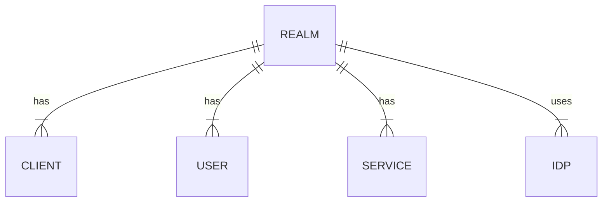
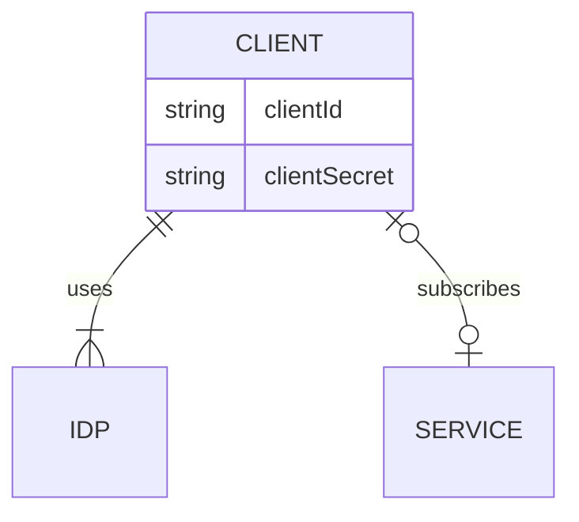
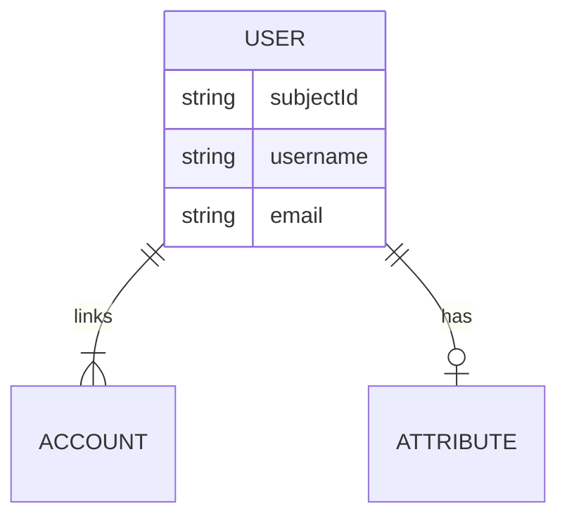
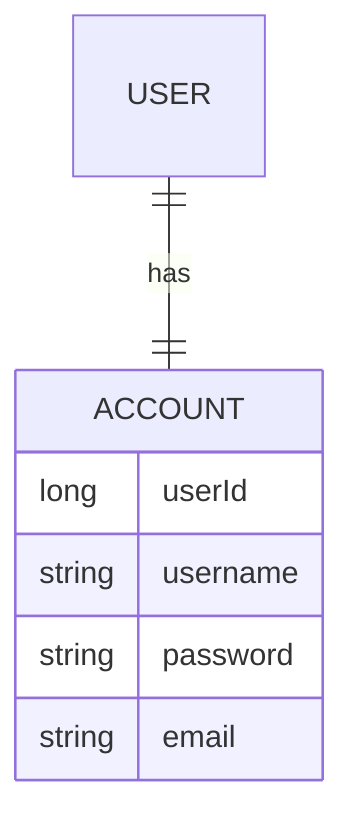
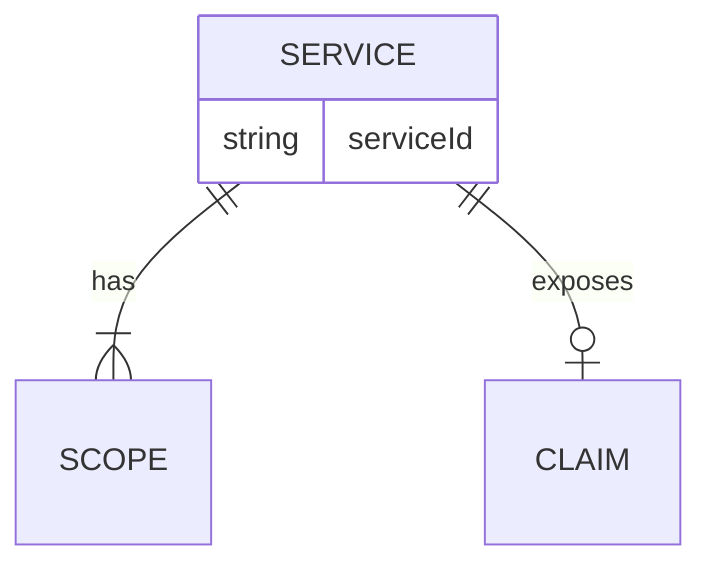
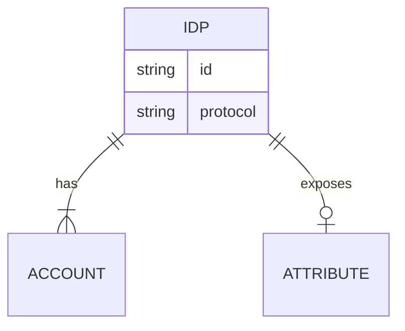

# Entity details

Entities are managed via different models, each designed to fullfil a specific role in the application stack.

From a top-down perspective we can usually find:

* entity(DTO): complete view detached from repository used between services and towards API clients
* entityImpl: service - specific view, derived from db model - detached
* entityModel: database-managed entity view
* entityAbstract: base abstract class used to model core entities

While many API use only *dto* and *model*, some require a more complex representation:

* client
* user

Different services will merge the base DB model entity with service-specific data, for example OAuth2 client properties, User Idp account attributes etc.

As implementation rule, every conversion between *models* and *dto* should be handled by static builders, avoiding manual property setting where possible.

As naming rule, entity without suffix should indicate the detached DTO, while internal representations can use different suffixes such as *-impl*,*-model* etc.

## Core

### Realm
An isolated, fully enclosed environment which serves as the container for clients and user management.
Additionally, a `realm` serves as repository for shared configuration items such as:

* services (APIs)
* identity providers
* internal user database
* security policies
* look and feel customization
* custom flow actions (eg login, registration)
* organization and roles


In most deployment scenarios, a single `realm` should match a unique `tenant` in a multitenancy-oriented architecture.




### Client

A client is an application in any form, be it a desktop, web or native application, a Single-Page-App (SPA), an API backend, a physical device etc.

By registering a `client` developers can obtain credentials useful to access the IdP, obtain a valid `token` and then validate user identity, access protected resources or exchange information securely.

The platform supports different client types, each one designed to leverage a specific set of OAuth2/OpenID authorization flows such as:

* Authorization code (with/without PKCE)
* Implicit 
* Resource Owner/Password
* Client credentials
* Device
* Refresh token


Additionally, each client can specify a list of properties defining in detail the security and operative settings for OAuth/OpenID such as:

* token type
* token duration and validity
* callback URIs
* scopes enabled
* certificates and secrets
* UI customizations
* 2FA and MFA requirements
* enabled IdP (shared from realm)

Additionally, a custom type of client dedicated to SAML environments is available, acting as a bridge between OpenID and SAML by posing as a provider.





### User

A `user` is a complex datatype which represents an individual inside the `realm`.

Each user possesses a list of `attributes` which describe its properties, and is linked to 1 or more `accounts` which map to login path via internal or external identity providers.

Each user is identified by a unique `subjectId`, an opaque string which unifies the entity and can be used by clients to assess the identity.




Attributes can be collected from external identity providers at login time, and shared via the `user` entity between connected accounts.
For example, a user with an internal account and connected to google could be described globally as follows:

```
{
    "subject" : "uuid",
    "username" : "fred",
    "email" : "fred@gmail.com",
    
    "accounts" : [
        "internal" : {
            "uid" : 123,
            "username" : "fred"
        },
        "google" : {
            "subject" : "google-xxx-000",
            "email" : "fred@gmail.com"
        }
    ]

}

```

When configuring identity providers, developers can choose where to share attributes with the global user entity, and describe how to map idp attributes.


While in a given realm a unique `account` can be connected to only one `user`, 
the very same `accounts` can be linked to different `users` inside separated `realms`.

#### Internal user provider

AAC provides realms with a dedicated, separated account repository which can be used to support local registration of users.

When enabled, the internal repository acts as an identity provider, interacting with user entities and apis in the same way as external providers such as google, facebook etc.

User selecting the local provider will be able to perform a local login, via username+password, and then obtain a session with AAC composed of a `user` entity linked to an `account` of type `internal`

The usage of the internal account repository is completely optional, while the usage of the user repository is a core component of the platform.



### Service

A service represents an API which is registered within the given realm.
By describing custom `scopes` mapping API actions and by leveraging `roles`, developers can protect endpoints via JWT or OAuth2 opaque tokens.
Additionally, services can expose `claims` which enrich the JWT token with custom metadata and attributes.




While `services` are registered inside a single `realm`, developers have the option to share their definitions with the whole platform, by declaring them *public*.
Public services are available for subscription for all the realms and the relative clients, regardless of the source.

By default, the platform generates a preconfigured `client` to represent the API backend linked to the service definition. The client will have `client_credentials` flow enabled, and be subscribed to the source service and to all the relative client scopes.

Additionally, the platform can initialize a test client to be used by developers for debugging and simulating an end-user application.


### Identity Providers

An identity provider connected to a `realm` enables users from the given IdP to log in and register their accounts.
The platform supports IdP offering the following protocols:

* OpenID Connect
* (SAML)
* (LDAP)

Additionally, an internal IdP is always enabled and supports the local management of users, accounts and roles.
By registering an external IdP within a realm, users will have the option to login via the external provider and automatically obtain a validated account inside the platform.
The login flow supports the retrieval and mapping of user `attributes` from the external provider to the internal `user` entity.
When configuring identity providers, developers can choose where to share attributes with the global user entity, and describe how to map idp attributes.



While the system supports the definition of custom providers, developers can adopt configuration templates pre-made for the major social networks.
At runtime, each client will be able to select one or more IdP from the realm selection, and users will be able to login transparently.