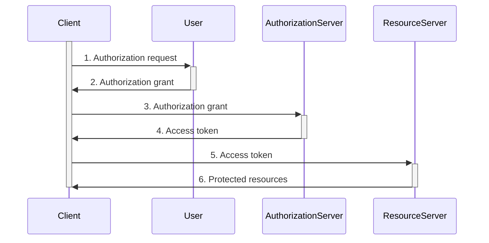
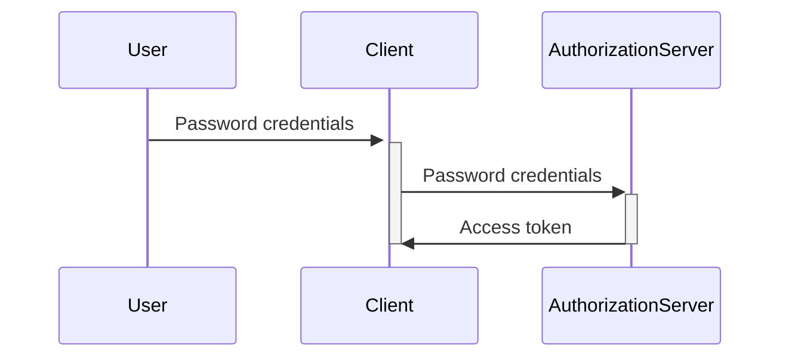
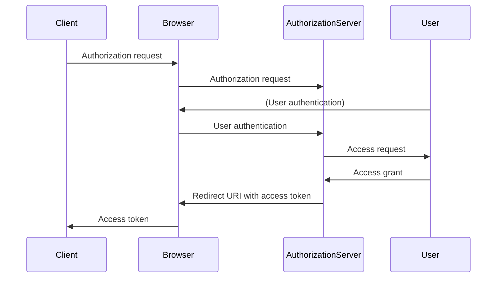
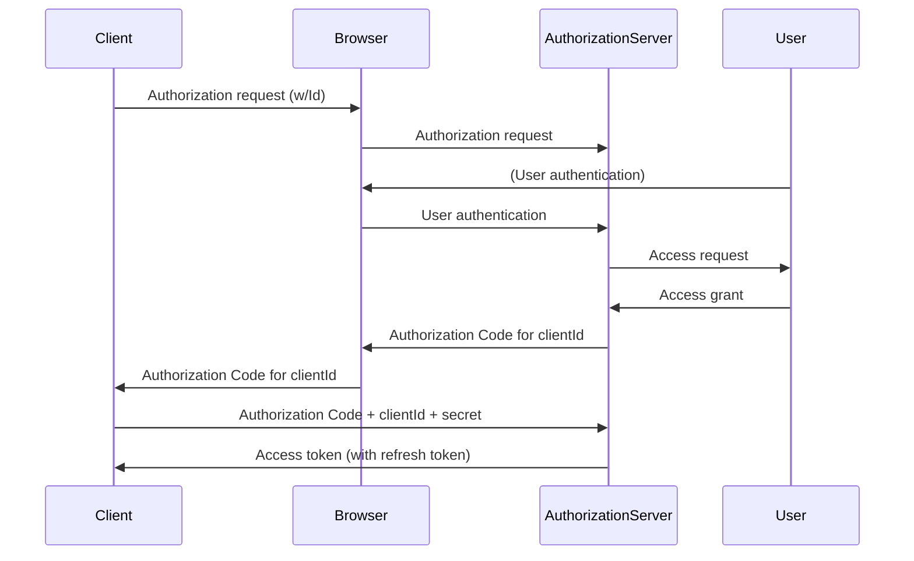
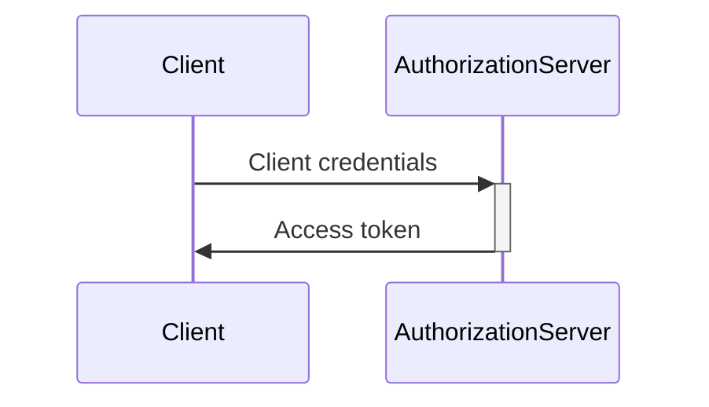
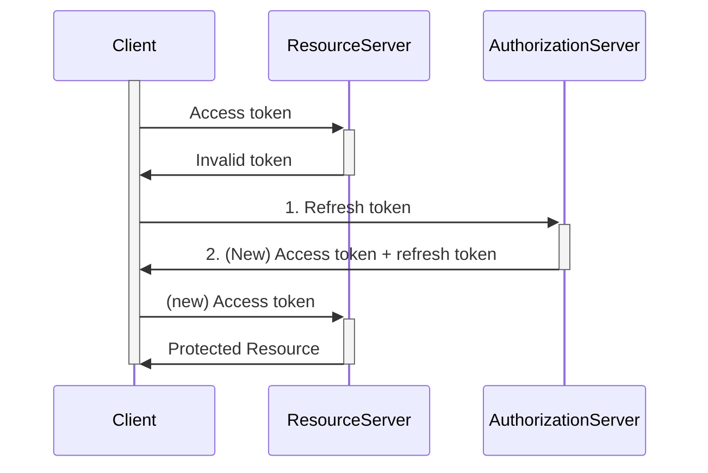
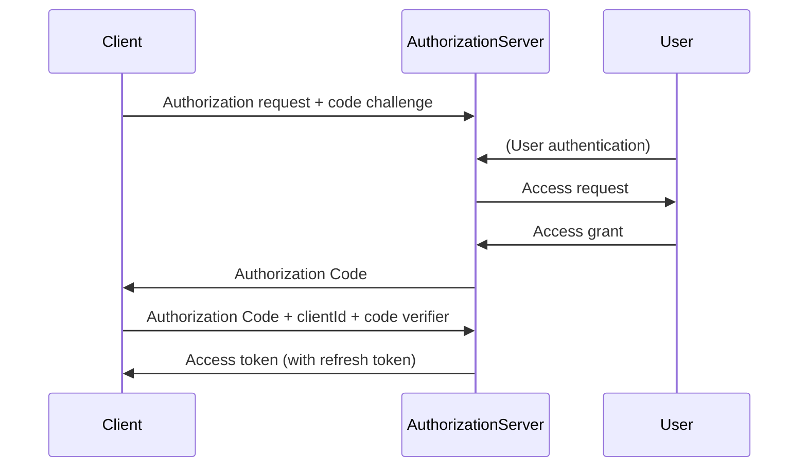

# OAuth2

TODO translate, contestualize for AAC

## Finalità

L'uso di OAuth permette ad una applicazione (interna o di terze parti) di accedere a risorse protette in maniera sicura, controllata ed affidabile.

### Scenari di utilizzo

OAuth2 è stato sviluppato per rispondere alle esigenze di accesso a risorse protette. Alcuni scenari di esempio sono:

* client-server sia per applicazioni interne che di terze parti
* applicazioni native (desktop o mobile) distribuite in ambienti sicuri e non
* integrazione di componenti e API
* comunicazione server-to-server
* Internet of Things (IoT)
* sistemi distribuiti e cloud native

## Il modello

Il framework OAuth2 è basato sul concetto di *delega di autorità*: un *client* ottiene una autorizzazione limitata ad accedere a delle *risorse protette* da parte del *proprietario*.

### Delega di autorità vs identità

Il funzionamento dei processi di autorizzazione e controllo di accesso permette di limitare le informazioni condivise con i client al *privilegio minimo possibile*.

Delegando l'*autorità di accedere ad una risorsa*, invece che le credenziali di autenticazione, il proprietario (l'utente) rimane in controllo della propria identità e delle risorse possedute.

## OAuth2: vantaggi

Separando il ruolo di client da quello dell'utente e introducendo un layer di autorizzazione dedicato OAuth2 permette di :

* mantenere le credenziali di accesso segrete (a client e server)
* mantenere il controllo sulle risorse in mano all'utente
* eseguire la revoca dell'autorizzazione
* limitare le azioni e le modalità di uso delle risorse

## Attori e ruoli

Gli attori coinvolti in OAuth2 sono:

* il proprietario della risorsa (*resource owner*)
* il fornitore della risorsa (*resource server*)
* il server di autorizzazione (*authorization server*)
* l'applicazione (*client*)

### Attori: Resource Owner

Il *proprietario delle risorse* è l'utente che autorizza una applicazione ad accedere a tali risorse.

Tramite l'utilizzo di *scope* è possibile limitare tali accessi a determinate azioni.

### Attori: Resource Server

Il *resource server* è il fornitore di risorse protette: una API che gestisce contenuti e informazioni *dell'utente* e che effettua il *controllo di accesso*.

### Attori: Authorization server

L'*authorization server* è incaricato di gestire le richieste di accesso alle risorse per l'utente, fornendo una interfaccia tramite la quale il proprietario delle risorse può validare la propria identità e approvare l'accesso dei client.

### Attori: Client

Il *client* è l'applicazione che desidera accedere alle risorse dell'utente e eventualmente eseguire azioni su di esse.

Per poter operare necessità dell'autorizzazione, che ottiene previa *approvazione* dall'utente tramite l'*authorization server*.

## Il flusso generale

Il flusso alla base del framework OAuth permette di:

* stabilire l'identità degli attori
* richiedere l'accesso alle risorse
* *approvare* tale accesso
* trasmettere l'informazione di *autorizzazione*

La comunicazione tra le varie parti si basa sul concetto di *trasmissione sicura*.

Tramite l'uso di **token** le informazioni di autorizzazione possono essere scambiate tra gli attori garantendo:

* **correttezza**
* **validità**
* **affidabilità**

## Core spec: RFC6749

Il framework è definito tramite pubblicazione nel 2012 dell'*RFC 6749* da parte dell'*Internet Engineering Task Force (IETF)*:

> ### The OAuth 2.0 Authorization Framework

Il framework OAuth2 come definito dalla specifica base si occupa di definire una serie di *flussi di autorizzazione* che permettono all'utente di delegare l'accesso alle risorse ad un client in maniera sicura su HTTP.

### Core spec: flusso astratto

Il flusso di autorizzazione segue generalmente i seguenti passi:

* l'applicazione richiede una autorizzazione dall'utente
* l'utente approva (o rifiuta) la richiesta
* l'applicazione richiede un *access token* al server di autorizzazione
* l'applicazione utilizza il token per accedere alle risorse protette

## Core spec: i flussi disponibili

La specifica prevede la definizione di diversi tipi di *grant* che implementano il flusso base in contesti specifici:

* resource owner grant
* implicit grant
* authorization grant
* client credentials grant

### Core spec: Resource Owner Grant

Il flusso denominato *resource owner password grant* prevede che l'utente fornisca le proprie credenziali di accesso direttamente all'applicazione client, che le utilizza per ottenere il token di accesso.

Il flusso *resource owner* è l'applicazione del *vecchio* modello client-server, precedente i moderni framework IDM.

Fornendo le *credenziali di accesso* ai client gli utenti perdono il controllo della propria identità e delle risorse protette.

Il suo uso è sconsigliato fin dalla specifica iniziale, e deprecato dalle versioni aggiornate dello standard.

### Core spec: Implicit Grant

Il grant *implicit* adotta un flusso basato su redirect, dove l'applicazione richiede all'utente di approvare l'accesso, ed ottiene dal server di autorizzazione un token di accesso.

L'autenticazione e l'approvazione delle richieste vengono gestita via browser (*user-agent*).

Nel flusso *implicit*:

* il client richiede l'autorizzazione all'utente tramite redirect via browser
* l'utente approva la richiesta presso l'auth server
* l'auth server fornisce al client un access token, embeddandolo nel *redirect url*

Il flusso *implicit* permette di controllare la gestione dell'accesso e di non rivelare le credenziali alle applicazioni, ma trasmette i token di accesso come parametri via browser.

Questa modalità permette ad altre applicazioni e all'utente di scoprire i token, e non è quindi in grado di assicurare la *confidenzialità*.

### Core spec: Authorization Grant

L'*authorization code grant* prevede di fornire i token di accesso alle applicazioni tramite un flusso *redirect-based*, in maniera similare ad *implicit grant*.

La differenza risiede nell'uso di codici di autorizzazione (non riusabili) per trasmettere l'autorizzazione ad ottenere un *access token*.

Nel flusso *auth code*:

* il client richiede l'autorizzazione all'utente tramite redirect via browser
* l'utente approva la richiesta presso l'auth server
* l'auth server fornisce al client un *auth code*
* il client richiede direttamente all'auth server un access token fornendo prova di identità e auth code
* l'auth server risponde al client con l'access token

Il grant *auth code*, oltre a garantire la riservatezza delle credenziali utente, permette di ottenere la confidenzialità nella trasmissione degli access token anche nei confronti dell'utente e del browser: solo client e auth server sono coinvolti nella trasmissione.

### Core spec: Client Credentials

Il grant *client-credentials* permette alle applicazioni client di accedere a risorse protette utilizzando la propria *identità* in luogo di quella dell'utente.

Non necessitando di interazione utente il flusso non richiede passi di approvazione e può essere completato in maniera programmatica (non-interattiva).

Le modalità di *autenticazione* del client solitamente dipendono dall'utilizzo di *credenziali* nella forma di *clientId+clientSecret*, ma la specifica OAuth permette l'utilizzo di altre forme di autenticazione se richieste dal contesto applicativo.

### Core spec: Refresh Token

Un tipo di token speciale è il *refresh token*.

La sua funzione è permettere ai client di ottenere un nuovo *access token* dopo la scadenza, senza dover ripetere il processo di autorizzazione.

Quando un access token scade, un client può richiederne *in autonomia* uno nuovo fornendo all'auth server le proprie credenziali e il refresh token associato.

Se il refresh token è valido, l'auth server andrà ad invalidare l'access token precedentemente associato e ne genererà uno nuovo, fornendolo al client.

## Applicazioni mobile e native

Le applicazioni distribuite sui dispositivi degli utenti non possono essere considerate *confidenziali*: utilizzando il flusso *auth code* c'è il rischio che le credenziali del client vengano compromesse.

Una soluzione è adottare un flusso *meno sicuro*, quale ad esempio *implicit grant* tramite browser di sistema. Non è in ogni caso possibile assicurare che i token o gli *auth code* non vengano intercettati.

## Mobile spec: PKCE

La soluzione adottata tramite *RFC 7636* prevede un meccanismo sicuro di verifica dell'identità che evita la trasmissione dei secret:

####   Proof Key for Code Exchange by OAuth Public Clients

L'idea alla base del protocollo è estendere il grant *auth code* e sostituire la verifica dell'identità client tramite secret con un meccanismo challenge/response basato su algoritmi crittografici.

Tale approccio garantisce che l'auth code rilasciato sia utilizzabile solo dal legittimo destinatario.

