# AAC architecture

# Overview
TODO

# Layers

Reference architecture for core and api modules:

* controller: exposed as endpoint
* manager: handles every operation for controller or cross service on dto
* dto : shared representation of model
* service: handles every operation on model via repository, translates to dto
* repository: handles persistence
* model: internal entity definition

Inside core components services can access multiple repositories. Every other module has to interact with services from their manager.

Transactions are handled usually at service level, when required by context at manager level.

# Graph

```mermaid
graph TD
    CORE --> SESSION
    CORE --> UI        
    CORE --> TS[Token Service]
    CORE --> OAUTH2p[OAuth2 Provider]
    CORE --> OPENIDp[OpenID Provider]
    CORE --> SAMLp[SAML Provider]
    CORE --> SUBJECT
    CORE --> USERAPPROVAL
    CORE --> BOOTSTRAP
    CORE --> AUDIT
    CORE --> AUTHORITY
    CORE --> CERTIFICATE
    CORE --> KEY
    CORE --> K8S

    CORE --> API
    API --> APIKEY
    API --> PROFILE
    API --> ROLES
    API --> APIM

    

    CORE --> REALM
    REALM --> CLIENT
    REALM --> USER
    REALM --> SERVICE
    REALM --> ROLE
    REALM --> IDP
    REALM --> HOOK
    REALM --> CERTIFICATEr


    USER --> ACCOUNT
    
    CLIENT --> FUNCTION
    CLIENT --> KEYc
    CLIENT --> CERTIFICATEc

    SERVICE --> SCOPE
    SERVICE --> CLAIM
    


    IDP --> OAUTHc[OAuth2 Client]
    IDP --> OPENIDc[OpenID Client]
    IDP --> SAMLc[SAML Client]
    IDP --> SPIDc[SPID client]


    UI --> USER_UI
    UI --> SYSTEM_UI
    UI --> DEV_UI


    BOOTSTRAP --> REALMb
    BOOTSTRAP --> CLIENTb
    BOOTSTRAP --> USERb
    BOOTSTRAP --> SERVICEb
    BOOTSTRAP --> ROLEb

```

