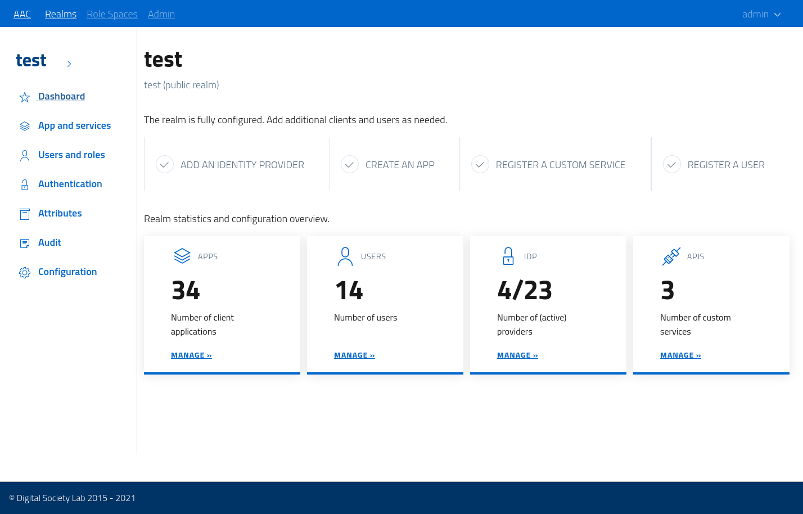
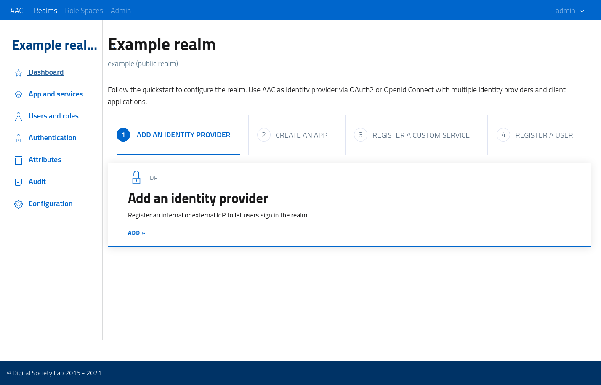

# Quickstart: realms

After registering with AAC as a user in the *system* realm, developers can access the dev console by logging in and opening the *developer* view.

Realm can be created by AAC global administrators, or directly by developers (if enabled).

In order to define a valid realm the registration process requires users to provide a valid *slug*, which is a string identifier which will be used to uniquely address the realm in URIs and URLs. 

Any valid slug can be used, as long as it's globally unique (across the entire AAC installation).

Additionally, users need to specify a descriptive *name*. which will be shown to users and in login/administrative pages.

By default, realms created by developers are configured as *private*, which indicates that they are accessible only by directly navigating to the realm URL, and the won't be publicly listed on the global entry-point. Do note that this settings only affects realm *visibility* in login pages: any access needs to be authenticated under any configuration.

## Dashboard

After the creation of a realm, developers and administrators with a valid *authority* will be able to open the realm *developers console* to configure the realm.

The console will show a navigation menu on the left, with sections grouping logical areas of configuration, and present an informative *dashboard* as welcome page.

The dashboard portraits an overview of the status and activity for the selected realm. 

When the realm is blank, i.e not configured, the dashboard will present a guided configuration, divided in steps, aimed at getting developers up and running with the basic setup. The quickstart follows the same steps as the documentation, asking developers to configure in order:

* an *identity provider*
* a *client application*
* a *custom service*

And then invites developers in registering a test user to test drive the integration.

By following the steps, users will be directed to the various configuration sections and be able to complete the quick start in an easy and immediate way.