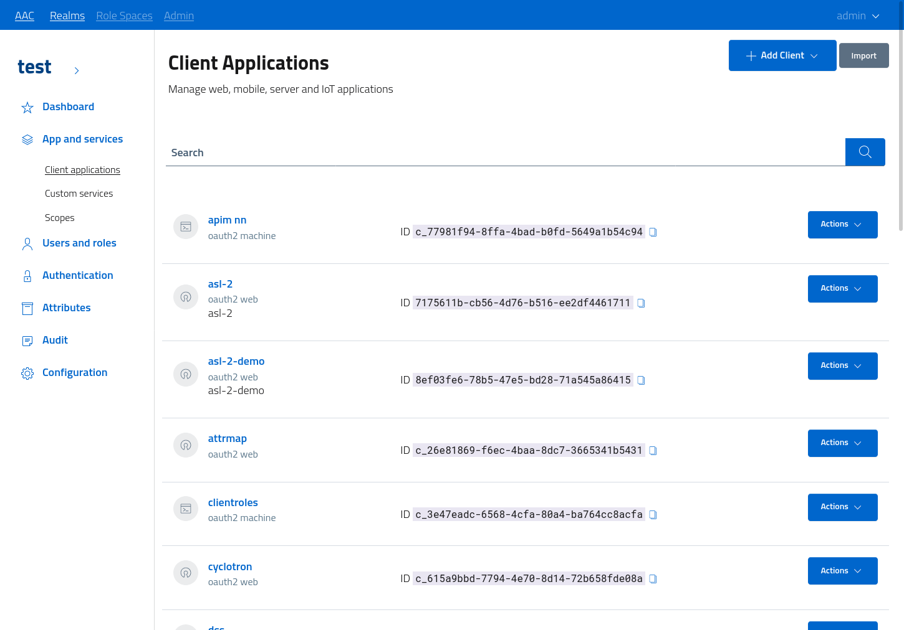
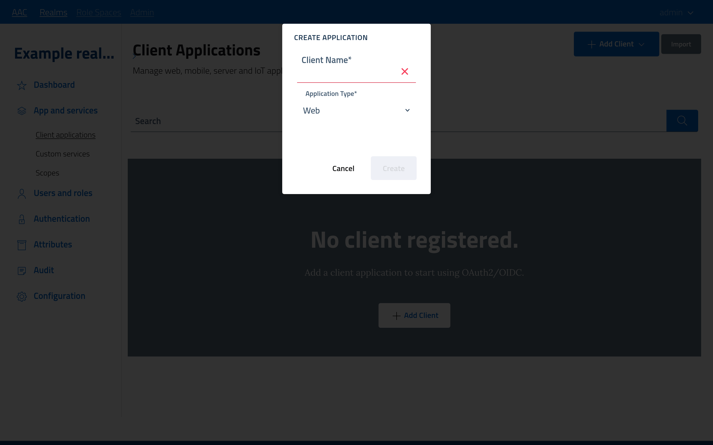
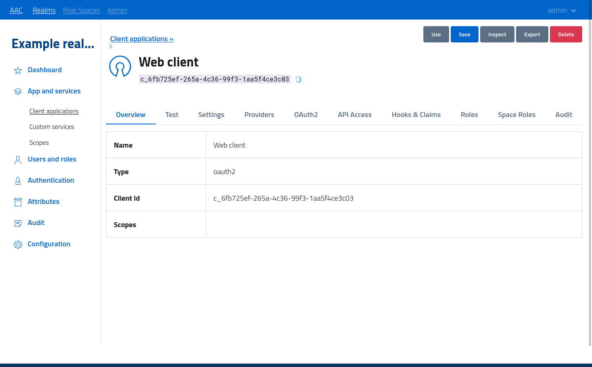
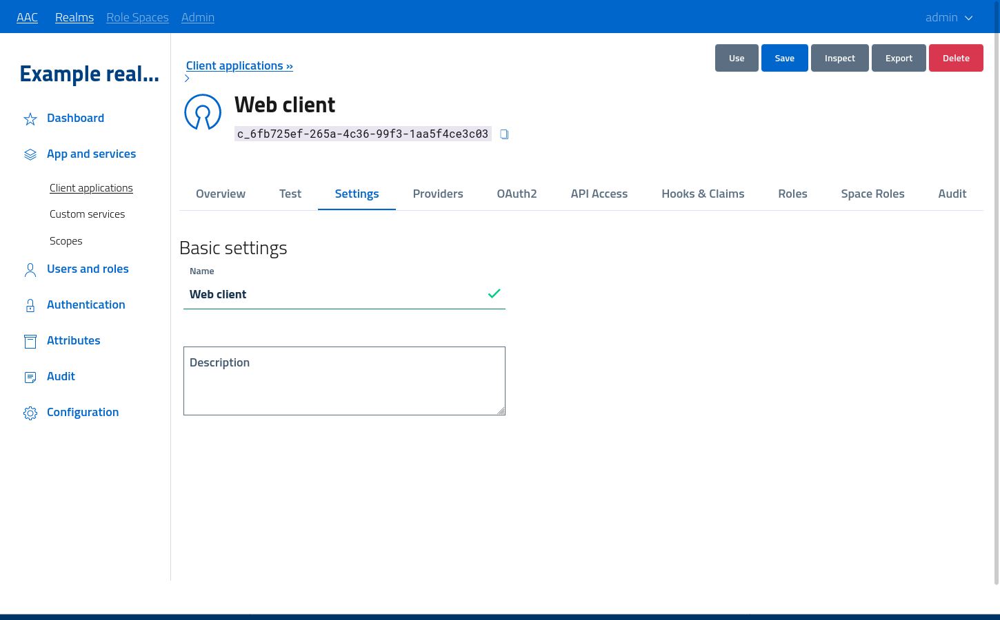
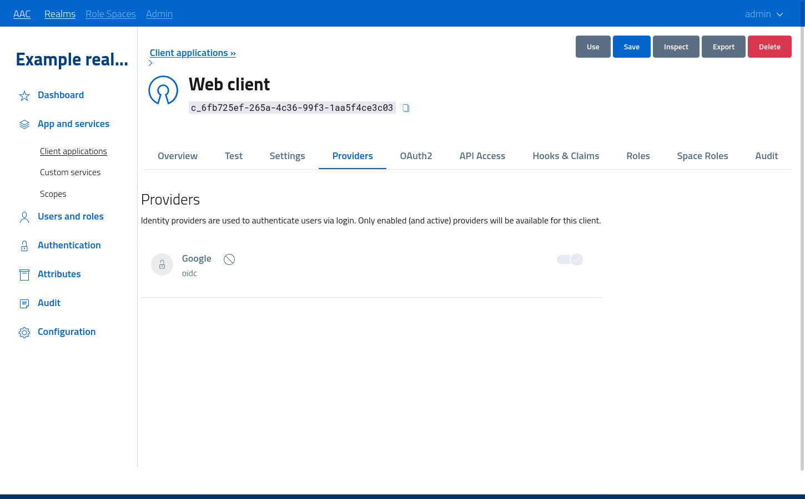
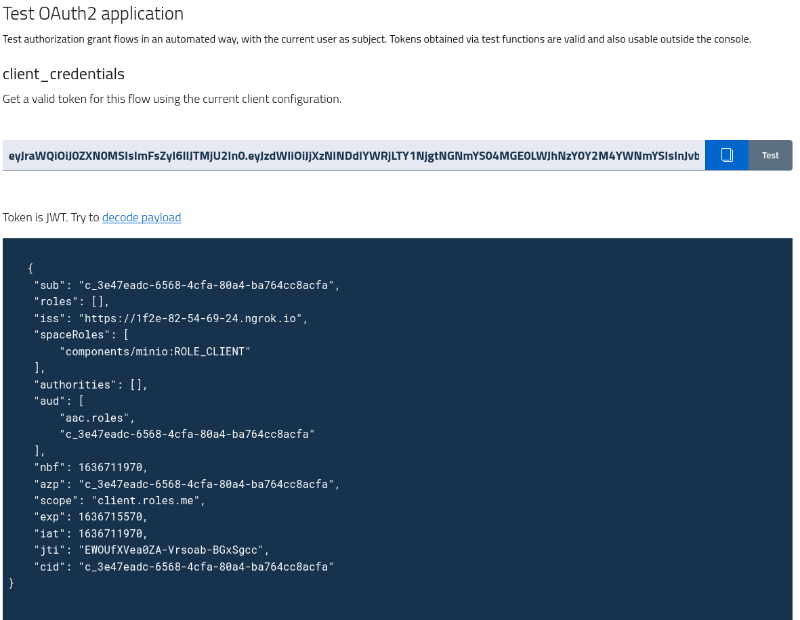
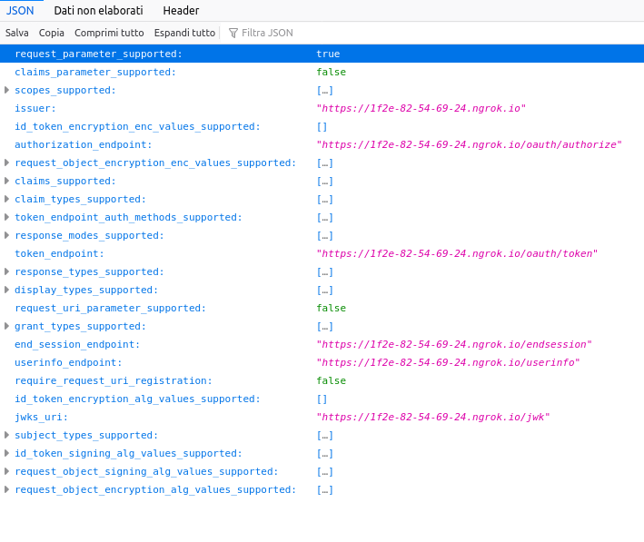

# Client applications

Clients are external actors which leverage AAC to obtain the following information as verifiable (trusted) data:

* (user) identity details
* (user) authentication details
* access tokens for external services

While for the first two options the information flow only involves communication between AAC and a given client, via am HTTP channel, the latter integrates an external party in the communication, which will also need to interact with AAC to validate such tokens.

The communication flow is  defined by well-known and widely adopted standards such as *OpenID Connect* for identity and *OAuth2* for authorization.
Future development plans include the support for *SAML2* via the web profile for single sign on, as an alternative to path to *OpenID*.

Clients, in order to interact with AAC, need to possess a valid *registration*, which can be obtained either manually, by entering the dev console and adding a client, or programmatically, via *OpenID Dynamic Client Registration* protocol.

This section documents the creating and management of clients via console. For API access please open the dedicated documents.

## Clients console

Please access the realm *dev console*, by performing authentication and then navigating to the given realm.
From the navigation menu on the left the *app and services > client applications* section will open the management section, where all the registered clients will be listed.




Do note that as of now, AAC only supports *OAuth2/OIDC* clients: all the creation and configuration sections described in this guide are specific to this client type.

## Client creation

In order to create a *new* client, developers need to provide at minimum a valid *name*. AAC will then assign a unique *client identifier*, bounded to a *subject* of type `client` which will permanently identify this registration across the whole installation.

Please follow the *add client* button to open the modal window, select an application *profile* and then fill in the name before submitting the form.




The various profiles identify a specific *OAuth2* scenario and will pre-configure the optimal settings, but everything will be fully customizable after creation by developers.

The available profiles are:

* **Web**: client is a web application consumed via browser, which needs to access backend APIs
* **Native**: client is a native application, which can leverage the browser to perform authentication and then accesses backend APIs by itself
* **SPA**: single-page web application, lives inside browser with no external components
* **Machine**: a backend service which wants to interact with other APIs by itself, with no user involvement.

Do note that profiles will be periodically updated and tuned, in order to complain with *OAuth2* standards and to enforce the optimal security policies.
As such, please select an appropriate profile and try to use different clients for different needs.

In particular, the following aspects will be enforced in future versions:

*  *SPA* profiles will be treated as *public clients*, with no ability to keep credentials private and thus won't be assigned a *secret*: apps will need to use *authorization_code+PKCE* to obtain tokens. Furthermore, redirect URIs will be restricted to URLs.
* *Web* apps will be treated as *public clients*, with no secrets assigned, when they enable the *implicit flow*. By enabling *authorization_code* they will be treated as *confidential clients*, and AAC will assign a secret. Same as *SPA*, redirects will need to be URLs to be registered.
* *Native* applications will be treated as *public clients*, without the ability to use a secret: they will use only *PKCE*, but will be able to register both URLs and URIs as valid redirects. 
* *Machine* apps will be able to use only the *client_credentials* flow.


## Client configuration

All clients will be configured by defining the details for the following aspects:

* *basic* settings
* *provider* settings
* *OAuth2* settings
* *API access* settings
  
At creation, each section will be pre-populated with a barebone configuration, in accordance with the *application profile* selected. Please review all the sections to make sure all the important settings are properly configured.

To open the configuration click the *actions > edit* button. The management console is depicted in figure.



The tabs enable developers to navigate to specific sections of the registation.

### Basic settings

Basic settings are related to the *presentation* of the application in a way suitable for user interaction:

* **name** identifies the application
* **description** is an informative text with detailed information about the app




Please use meaningful names, otherwise users won't be able to properly identify and recognize the application at access or authorization phases.

### Providers settings

Every realm can define multiple *identity providers* for handling user identities and authentication. By default, every application will be able to obtain users and tokens from any active provider: users will be offered multiple choices at login, according to their preference.

Applications can obtain detailed information on which *authority* and *identity provider* handled the user login by asking for the `profile.accountprofile.me` scope, otherwise this information won't be shared.




In some cases, client applications will require the usage of a specific subset of providers, or even a single one, in order to authenticate users. By toggling the state in the *providers* section, the configuration of this very client will be updated to require the usage of the selected providers. Users trying to access the application with an invalid *identity* (one from a different provider) will be asked to re-authenticate with an approved idp.

## OAuth2 settings

OAuth2 defines a client model which controls the application *grant types* available, the *authentication methods* the client can use to present itself to AAC, and the *redirect uri* registered.

From the spec, callback URIs exposed by client applications has to be registered with the authorization server (AAC) before use. This measure is dictated by security reasons, and ensures that authorization codes and tokens are not sent to a malicious third party via browser redirects. While this alone doesn't ensure the confidentiality of the communication, when adopted in conjunction with *PKCE* and a proper authorization flow we can obtain a reasonably secure access.

Do note that as previously introduced, application *types* are defined to restrict which settings and operation modes can be used by clients, following the *least privileges principle*.

When possible, clients will be issued a confidential *secret* which can be used to perform authentication via:

* `client_secret_basic`, basic http authentication in header
* `client_secret_post`, where authentication details are provided as POST form parameters

In order to use *PKCE* without a client secret, developers need to enable the `none` authentication method.


Other relevant settings in the advanced section will be covered in reference documents.

## Api settings (scopes)

Client applications can obtain *access tokens* useful for accessing protected resources. These resources are registered in AAC, and control the access by defining *scopes*, which are identifiers defining a specific action on a given resource.

Clients wanting to perform an actions, such as reading a given resource on behalf of the user, need to ask permission by including the relevant *scope* in the authorization request. Users will then be asked to confirm such operation, and in affirmative cases clients will obtain a valid access token to be delivered to the resource server. This process is the core of the *OAuth2* framework.

In order to ask for scopes, for security reasons clients need to pre-define which scopes they are interested in, by registering those scopes in their configuration. At access time, clients will be able to ask any of the registered scopes, and nothing else.

Scopes and resources available are divided into two main sections:

* **core** resources are managed and exposed by AAC, and cover users, groups, clients, management etc
* **services** are external resource servers registered by developers and exposed for client consumption


By selecting the relevant *scopes* and saving the configuration, clients will be able to leverage such scopes in their authorization requests.


For example, to obtain information about the currently logged in user AAC exposes (as per OpenId Connect standard) a `/userinfo` endpoint which returns information about users in a standardized format. 
Clients wanting to read such data will need to ask for the `openid` scope to access the API, and the for `profile` or `email` (or a combination of other profile scopes) to instruct AAC on which information they want to read.

As an example, you can find the client call for `/userinfo` on a test environment in figure. Access token opaque `kbWluIiwiaWF0Ijox` is used as *bearer* authorization header to access the protected resource, carrying the authorization for `openid+profile+email` scopes.

```bash
> GET /userinfo HTTP/2
> Host: aac4.kube-test.smartcommunitylab.it
> user-agent: insomnia/2021.5.3
> authorization: Bearer kbWluIiwiaWF0Ijox
> accept: */*


< HTTP/2 200 
< x-content-type-options: nosniff
< x-xss-protection: 1; mode=block
< cache-control: no-cache, no-store, max-age=0, must-revalidate
< content-type: application/json

{"sub":"u_abc7deda-9a8a-5490becbf857","zoneinfo":"GMT","email_verified":true,"realm":"digitalhub","preferred_username":"admin@kube.test.it","locale":"en-US","given_name":"admin","family_name":"admin","email":"admin@kube.test.it"}

```


## Test drive OAuth2

After configuring the client application, AAC offers the chance to test token generation from the management console, without the need to perform the full token flow from an external service. 

By accessing the *Test* tab and selecting one of the available grants, AAC will process and generate an *access token* using the currently logged in user identity and the given client configuration. 

Do note that for developers logged in via the system realm testing token generation may produce errors or inconsistent results. Is is advisable to define a local account internal to the realm as *developer* and use it to test drive configurations.

When the token generations is successful, AAC will offer developers the ability to decode JWT tokens and display a nicely formatted view of the content, reporting all the claims as encoded and signed in the JWT.




Among the information, in the figure we highlight the *sub (subject), aud audience)* and  *exp  (expiration)* claims which define the usage limits of the given token.

Tokens generated via *test* are valid and usable outside the console to call the resource servers reported in the *audience* field.

## Client usage

From the configuration page developers can fetch client identification and authentication properties, and then manually configure libraries compatible with oauth/oidc to integrate their applications with AAC.

In order to guide the integration process and provide assistance, AAC offers a series of *quickstart* guides available directly from the management console, which provide all the configuration properties, endpoints, usage models and communication specifications in a step-by-step format easily understandable by technical users.

Access the *app and services > client applications* section and then click on a configured client, or select *view* from the actions dropdown, to open the dedicated section.


Every grant or interaction flow available with the current configuration is reported: when selected, the page will display a multi-step guide with all the relevant information, configuration properties and *curl* examples to complete the task.


In figure we can see an example for an *authorization_code* grant with client secret.

By opening the *credentials* tab developers can quickly fetch and copy (via action button) client *identifier* and *secret*.


The *endpoints* tab reports all the relevant endpoints which can be used for external integration, depending on the client type and capabilities.


In particular, the *issuer metadata* endpoints can be used by clients compliant with the *OpenId (or OAuth2) discovery protocols* to perform auto-configuration, without the need to manually set every endpoint.
The auto-configuration is performed by parsing the *metadata* document exposed by AAC, which in addition to endpoints reports all the realm and client configuration capabilities, such as available scopes, authentication modes, grant types, response modes and types etc.


