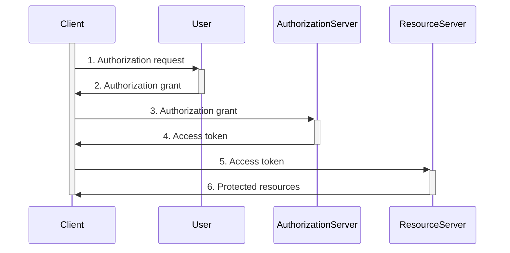
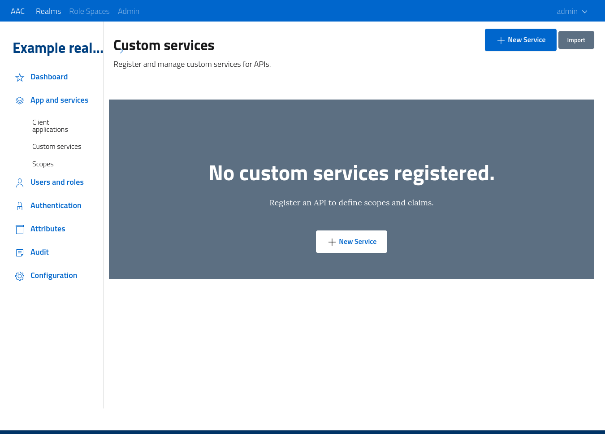
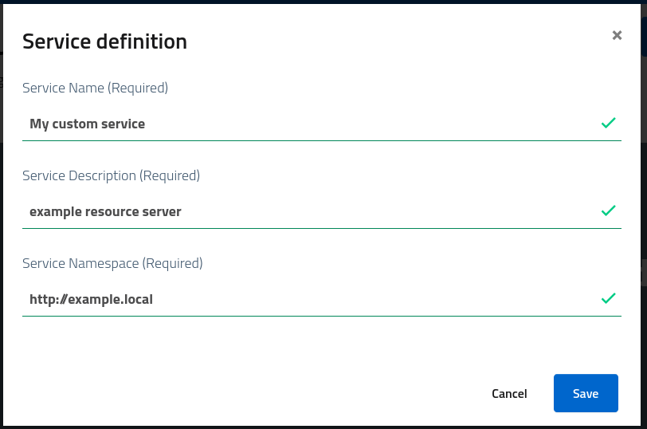
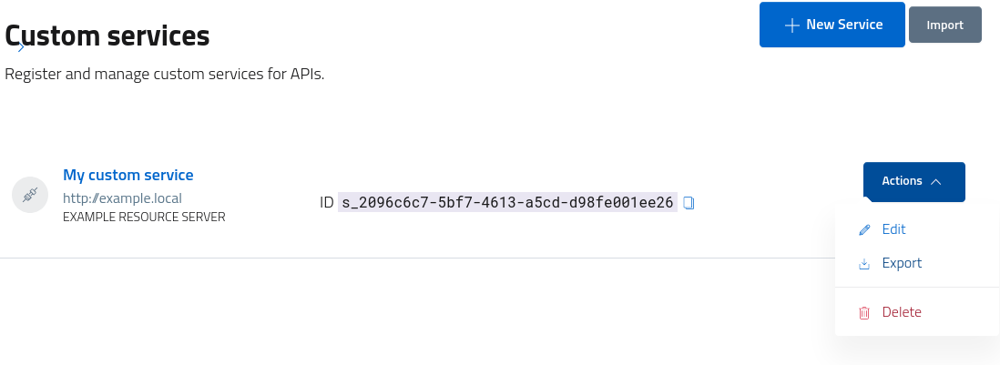
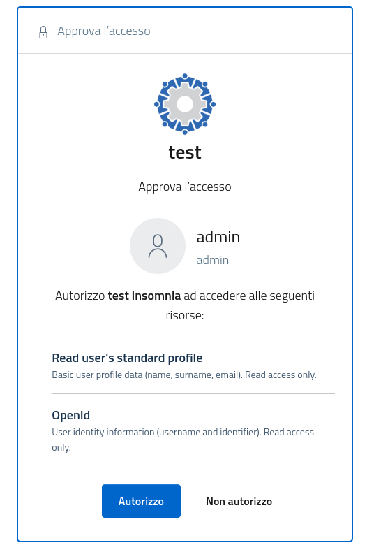
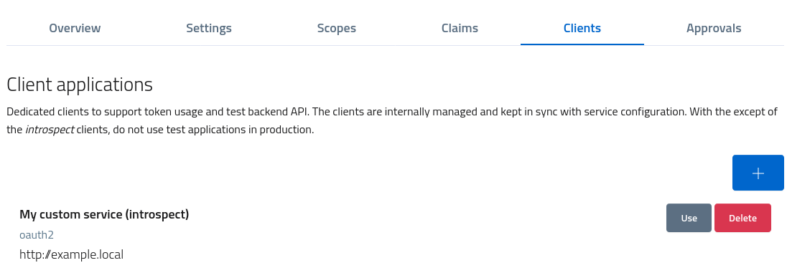

# Custom services (APIs)

AAC offers developers the ability to leverage the platform not only for performing user *authentication*, but also the chance to adopt the *OAuth2* authorization model to handle access to protected resources.

External services, which offers APIs for managing resources, are described in the OAuth2 framework as *resource servers*. AAC lets developers define these resource servers in the security realm, by registering their *namespace* along with the scopes identifying the available actions on the managed resources.

The idea is to properly define and separate *backend services* from clients accessing them, in order to obtain a sane architecture and support *authorization delegation* scenarios as following:

* a user's *resource* is managed by a *backend (custom) service*
* a *client* wants to perform an action on a user's *resource*

The process to support this flow should go as follows:

* the client *registers* itself on the *authorization server (AAC)* 
* the client asks a user's *approval* for performing the action on the *resource* by asking for the *scope* which identifies such action in the *resource server*
* the user *authorizes* the client to receive the *scope*, and thus perform the action
* AAC emits an *access token* describing in a verifiable manner such *authorization delegation*
* the clients accesses the backend API by passing the token as *authorization bearer*
* the resource server validates the *access token*, matching the *scope* with the action required and evaluating a local policy: on success the client will receive a response

The sequence diagram depicts this scenario.

## Custom services management

In order to perform the described flow, developers need to *register* backend services as **custom services* in AAC, obtaining the ability to define the associated *scopes* and then define policies for their approval.

Access the developers console in the realm by navigating to *apps and services > custom services*. 

The section will list all the services registered inside the selected realm, and let administrators create, update, manage and remove services.

Do note that *services* are registered inside a given realm, but they are globally visible and addressable across all realms. This approach lets developers publish their custom service for usage by users and clients of different domains: it is up to the actual backend implementation to manage and distinguish accesses. AAC ensures that all clients are validated and properly identified, and all users are authenticated following the identity providers specifications. This *resource sharing* policy is subject to reviews and updates when needed.

## Custom service creation

To register a new service open the console, select the *new service* button and fill in these fundamental information:

* *name*, a descriptive name for the service which will exposed to clients and users
* *description*, and extended text with detailed information
* *namespace*, a globally unique identifier for the given service across all domains

Developers need to pay attention to the **namespace** selected: it must be unique, meaningful and short. At the same time, it must be suitable for usage in urls and claims as *prefix* or *suffix*, according to needs. Each custom *claim* which services want to add to tokens will be placed under the given *namespace*, while *scopes* won't fall under the namespacing criteria (they are free-form).

Furthermore, *namespace* will be used as *resource indicator* under the OAuth2 framework to let clients signal which is the resource server they want to call. As such, it must adhere to the OAuth2 specification for resource *identifiers*.

TODO add link to standard

Do also note that *namespace* is not modifiable after creation: please select a suitable identifier or delete and re-create the registration under a different value.

## Custom service console

After creating, services will be accessible from the console for management, with options for *editing, export, removal* etc.

To access the management section and fully configure the service follow the link or select *edit* from the dropdown button.

The console lets developers update service *description, settings*, define and register *scopes* and custom *claims*, create and manage dedicated OAuth2 *clients* and handle manual *approval* for scope access.

After creation, a *custom service* is already usable by both clients and resource servers: the identifier defined in the *namespace* can be used as *resource indicator* to signal AAC the intention of clients to contact the selected service. The tokens produces in response will contain the *namespace* as *audience* to let backend servers validate the destination.

## Scopes definition

To model a more realistic scenario, the quick-start will illustrate how to define a custom *scope* identifying an *action* clients can perform on behalf of *users*:

* the resource is called `profile`
* the action is `read`

The scope will model this interaction by defining the `read:profile` operation, a scope of type `USER` subject to approval.

Click the *add* button to open the modal window, and the register the scope as in figure.

This custom *scope* will be associated with the service (under the namespace), but at the same time will be globally accessible for client consumption.

When clients will request access tokens with the provided *scope*, AAC will evaluate the scope approval policy, then ask users to explicitly give their consent, as shown in figure. When users approve the access, AAC will then build a complete *access token* with the scopes the user conceded, and the service *namespace* as audience. Clients will then be able to contact the backend service and perform the wanted action.

As seen in figure, users will be given the option to not authorize the request, denying the client from obtaining the scopes and thus blocking the client from performing the desired action on the resource.

## Service clients

Backend services need to *validate* access tokens in order to trust the information they carry. They can do so autonomously, when tokens are JWTs, or by asking AAC to directly validate and decode the content.

In order to interact with AAC, for example for token *introspection*, services will need to use a valid and registered *client*, with proper authentication methods and the related credentials. The service management console offers developers the ability to automatically and instantly create such clients, which will be kept in synch with the service definition without manual intervention.

Access the dedicated *clients* section and create the *introspect* client to obtain credentials useful for calling the `/oauth/introspect` endpoint from backend services, and be able to validate tokens submitted by clients.

The console also allows the registration of reference/test clients, but we encourage developers to always properly define their production clients directly from the dedicated console. 

Do note that services are not required to interact with AAC: when using JWTs they can locally validate tokens by comparing signatures with keys. In such cases it is advisable to avoid registering introspection clients, to minimize the surface attack and strengthen the system security.

## Service usage example

TODO

