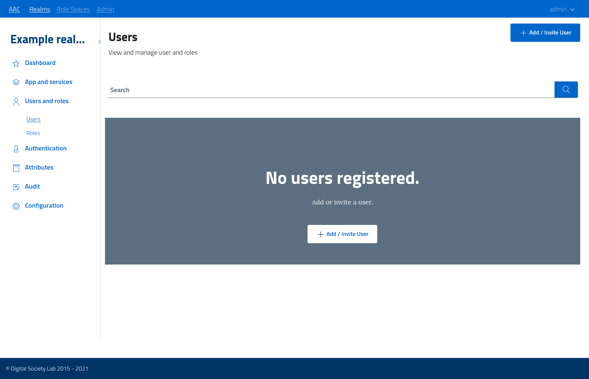
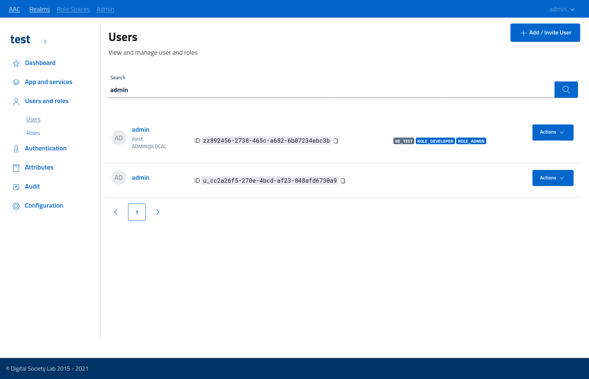
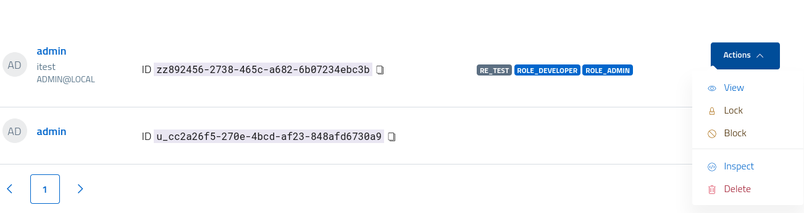
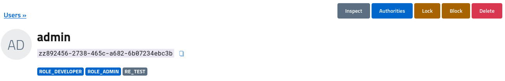
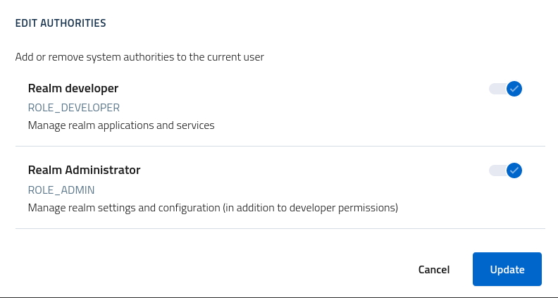
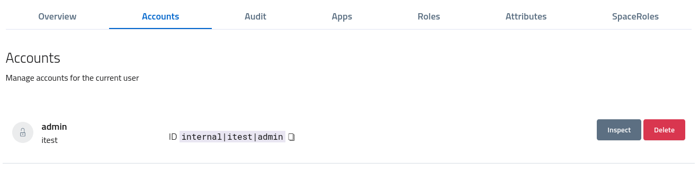

# Users and identities

In AAC users area modelled around the concepts of *subjects* and *identities*:

* a **subject** is a unique entity in the entire system
* an **identity** is a collection of a login user **account** bound to one or more **attribute sets**, as handled by an identity provider.

A **user** is thus a representation of a given person linked to a *subject*, in possess of one or more *identities* and whose properties are described by one or more *attribute sets*.

Users and usually registered automatically at login: after performing the *authentication process*, the identity provider will create a registration for new *identities*. As such, there is no direct way to manually or automatically register users: it is mandatory to perform the authentication flow to fully populate the *user* model.

Do note that some identity providers may allow administrators and users to *register* a new identity: this is provider specific and does not imply the creation of users in AAC. The registration of a valid identity with a selected provider will enable the user in performing the authentication and eventually completing the user registration.

## Users console

The administration console has a dedicated section for users management, with the ability to inspect, review, update, block/unblock and delete *users* from the given realm.

To access the console navigate to the *users and roles > users* section.
At start, a blank realm will report zero users. The interface will offer the ability to *invite* a user by performing a *partial registration*, where the system will record the email address of a new person and send an activation link. When the user clicks the link, or logins with the same address via any active identity provider, the registration will be completed.

The console supports pagination and search by keywords, to facilitate the management of user bases of any size.

## User management console

To review and manage a single user open the dedicated console from the list view, by either clicking on the name or selecting the *view* action from the dropdown menu.

The console reports detailed information on all the user identities, accounts, roles, permissions, attributes, connected applications and authorities. In addition it offers the ability to inspect and review the audit train, with detailed information on authentication operations, token creation, client approvals etc.

From the toolbar at the top administrators can change the *state* of the user, by disabling the login via *lock* or by fully *blocking* the user and forcing a logout from all applications.
A *locked* user won't be able to login from any identity provider, but all the non-expired tokens and active sessions will be kept intact. A *blocked* user instead will be forcibly logged out from any session and from all the connected applications supporting global logout, and all their tokens will be revoked.

## User authorities

Any user in AAC is associated with a set of *authorities* for the system. At minimum, every user will have the `ROLE_USER` authority inside their realm. 
By adding the `ROLE_DEVELOPER` or `ROLE_ADMINISTRATOR` authorities to users they will gain the access to the *realm console* dedicated to developers, with different usage rights:

* **developers** can manage applications, services, scopes
* **administrators** can manage identity and attribute providers, users, customizations etc.

Any regular realm user can become a *developer* or an *admin*: access the user console and open the *authorities* window by clicking on the toolbar action *authorities*. From the list apply any role as desired and save.

Do note that already logged in users will need to logout and then login again to obtain a privileged session.

## User accounts

Any valid *identity* associated to a given user is based on an **account** handled by a specific identity provider. By accessing the *accounts* section of the user console administrators can inspect, edit and delete accounts as needed.

Since accounts are handled by identity providers, which usually are external to AAC, there could be no actions available for editing the properties: only *internal* accounts are editable by now.

By selecting *inspect* a modal window will show the full model as json.

## Audit trail

Any operation such as *authentication*, *token generation*, client *approval* are performed by users via browser: the **audit** subsystem records and stores the details in an immutable ledger which can be reviews by authorized administrators.

Open the *audit* section of the user console and review the events as recorded by the system: a recap is reported in the table for easy access, but the details are available for inspection as json via the action button.

Notable properties logged by audit are:

* full date (with timezone)
* event type
* remote address (IP)
* user agent details (browser)
* language
* user session
* authentication tokens

