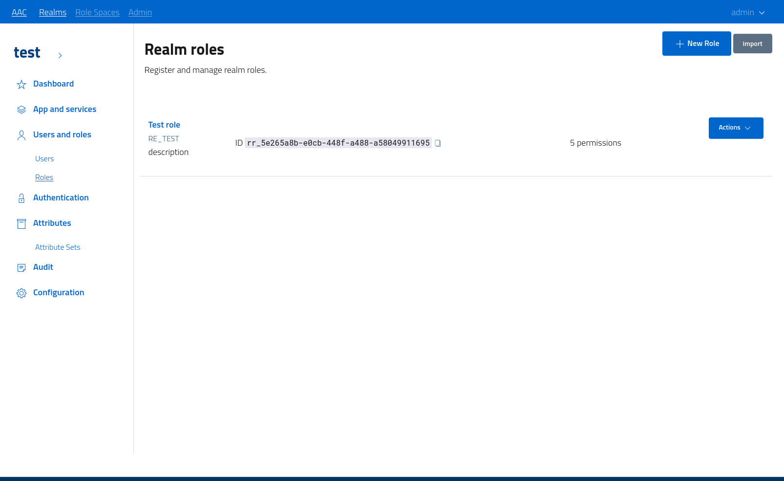
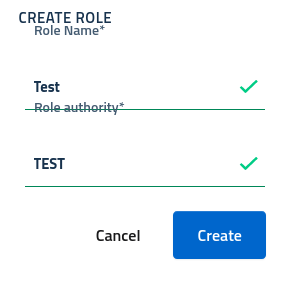
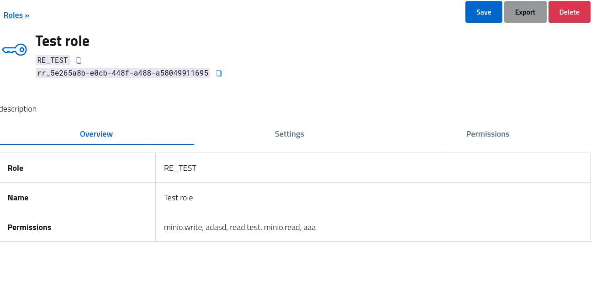
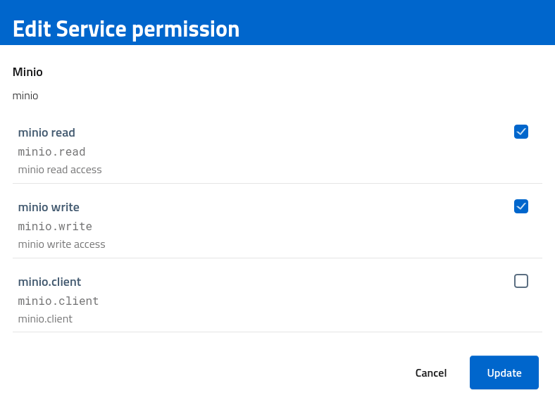
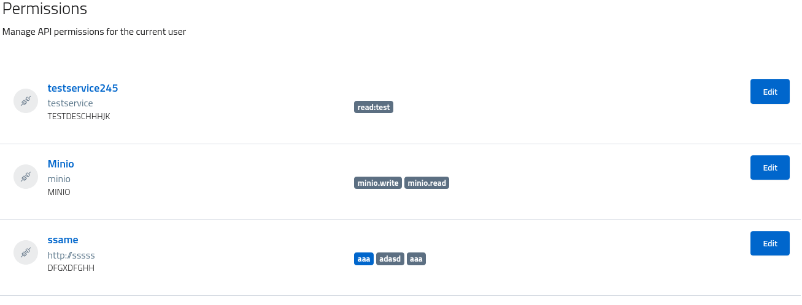

# Roles 

Roles are an abstraction used to define a specific actor used in authorization scenarios. 
AAC supports the definition of roles supporting an *RBAC* model, where users are assigned to roles to indicate the permissions they can obtain in a given realm.

Roles are defined at the realm level and are dependant on the scenario. They can be registered and used in two principal modes:

* as bare *identifiers*, resulting in a model akin to *groups* where each user can be assigned to one or more roles and the consuming service will decide the associated privileges
* as *bags of permissions*, where each roles is assigned some permissions on registered *custom services* (scopes) and then users will inherit those permissions when assigned the roles.

While the first mode leaves all the decisions on authorization to clients and backend services, the second model opens the ability to leverage AAC for performing authorization decisions, reducing the complexity and implementation costs of backends. For example, the API which exposes a set of *scopes* can leave the management of those to AAC, and be sure that only authorized users (ie with a role possessing the permissions) will be able to obtain those in tokens.

## Roles console

Access the management console by navigating to *users and roles > roles*. The system will list all the roles registered, along with the option for creating a new role on the fly.

To create a new role is is mandatory to provide the following:

* a valid *authority* identifier, a unique key which will be used as role identifier in tokens and approvals
* a user-centric *name*, describing the role
  
Open the dialog by clicking the *add role* action button and then save the newly defined role. After creation, the role will be assigned a unique *identifier* and will be ready to be used.

## Role management

In order to manage the role, edit the properties and assign custom permissions, open the dedicated console by clicking on the role name or by selecting the action from the dropdown.

The management console reports an overview of the role, and the various sections are dedicated to the basic settings (*name*, *description*) and the registration of permissions on custom services.

To add or remove permissions, open the tab and select a single service. Every scope assigned is listed as badge, and by opening the *edit* dialog administrators can update the approved scopes.

## Role assignment

To assign roles to users open the users console by navigating to *users and roles > users* and select an individual user. Scroll to the *roles* tab and then assign a role from the list of those available in the realm.

By assigning a role to a given user, it will inherit all the permissions associated with the given role. The section *permissions* will reflect the configuration and display every *scope* approved as badge.

It is possible to manually assign specific scopes to users by updating the permissions assignment for specific services. Do note that permissions assigned via roles have a higher priority and are unmodifiable: remove those from the role or remove the role from the user to manually approve/un-approve the associated scopes.

