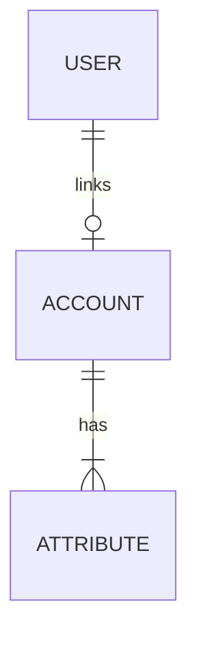
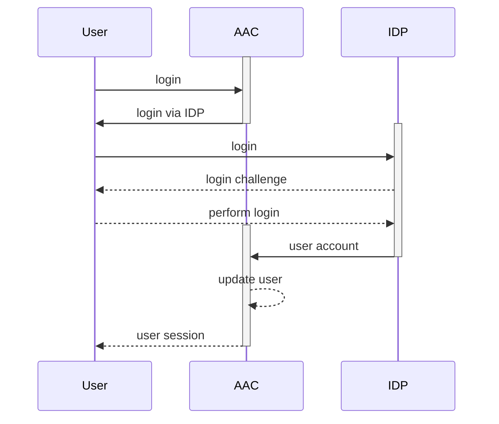
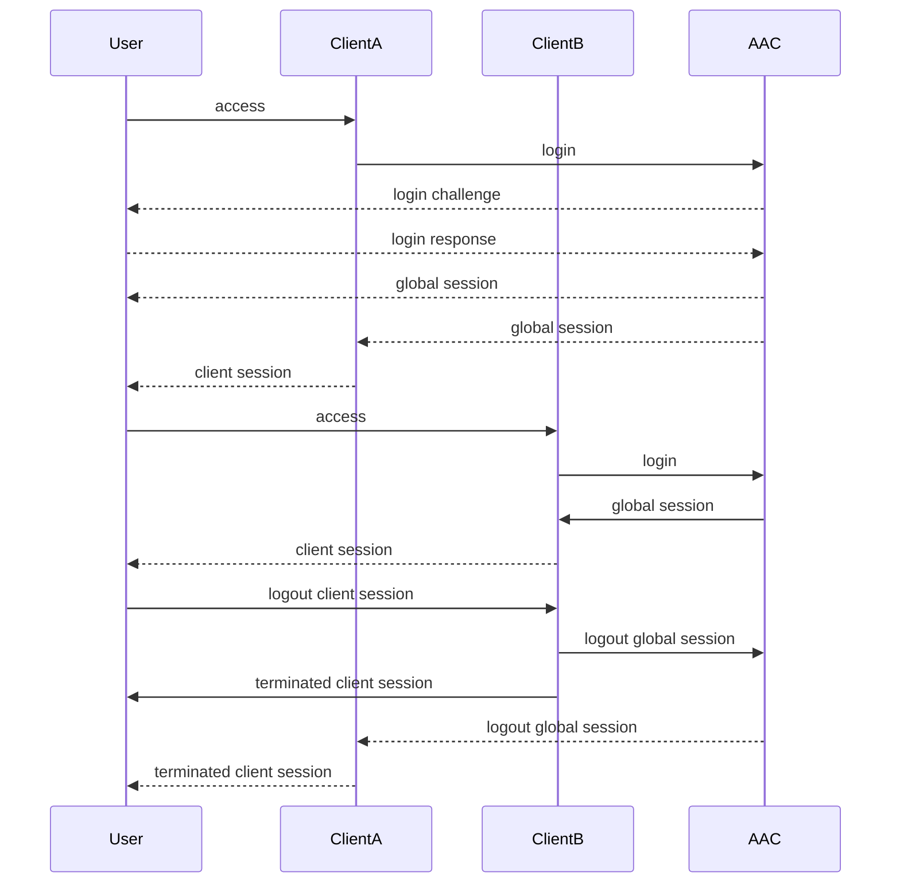

# Identity providers

While AAC acts as both an Authorization Service and an Identity Provider, the user accounts are fetched from separated user repositories, and validated via separated identity providers.

We define as `identity provider` an external (or internal) component which provides AAC with:

* user details in form of an account with attributes
* a login procedure validating the identity
* a verification method (for example signature) ensuring the correctness of the attributes received from the third-party

## User repositories

The internal representation of a user account in AAC is composed by the combination of a realm-specific `user` entity linked to one or more `accounts`. Accounts are fetched from user repositories which holds the actual details needed to provide information about the user identity, such as:

* username
* email
* name, surname

Each repository can hold a variety of user `attributes`, which are metadata describing a feature of a given user `account`.

By linking an `account` to a `user` entity we can map `attributes` from the provider into the global representation, or into an account specific section. 

When linking more than one account to the same user, we can compose a global identity characterized by a series of attributes fetched from different sources, mapped by rules into the global object. Consequently, client applications can access those attributes without specific knowledge of the data source behind the data.

## Login

The login process involves the authentication of a given user, which is the process aimed at defining and then verifying the *identity* of the user.

The process employed for authenticating users is specific to the identity provider, and does not directly involve AAC (except for the internal repository).

After performing a successful authentication inside the provider, AAC will obtain a valid `account` describing the user identity. At this stage, the core system will map the account to an existing `user` entity, if present, or create a new one from scratch.

Obtained the `user` object, AAC will map `attributes` from the `account` to the global entity according to mapping rules.

From now on, the session will contain a complete user entity with the most up-to-date attributes. The system does not provide a session update mechanism: attributes are fetched once every session at login and persisted for internal use.

## Logout

When in a session, users have the ability to terminate it by calling the appropriate AAC endpoint.

The logout procedure will invalidate the session at AAC level, leaving sessions at the IDP level as is (except for the internal repository).

The same behavior can be observed in client applications: logging out of an AAC session does not alter in any way application sessions. There is no communication between AAC and clients regarding active users sessions.

## SSO

For Single-Sing-On scenarios clients are expected to transparently share not only user *identities* via the same provider, but also share a globally managed *session*.

This means that in a given session every client under the SSO environment shares :

* user details
* login/logout flows

When in SSO, a user already logged in via client A should not be presented with the choice to login in client B: the global session is already authenticated and populated.
Under the same constraints, a user logging out from client A will automatically and contextually terminate the session with client B.

This scenario is currently under development, following the OpenID Connect - Session spec.
