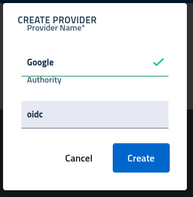
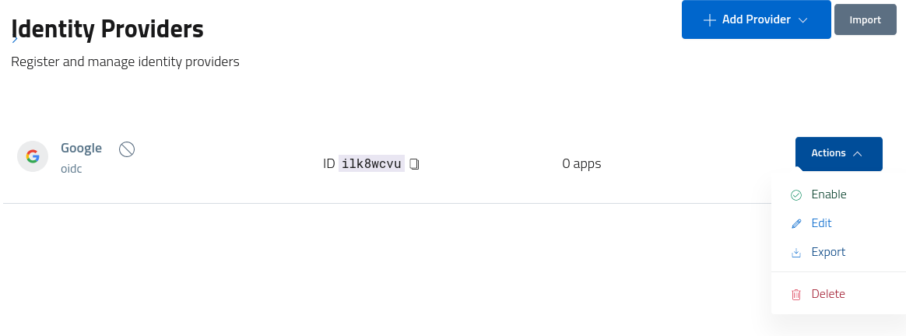
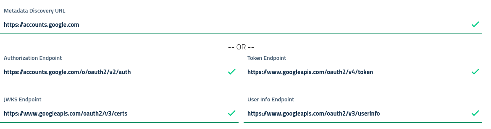
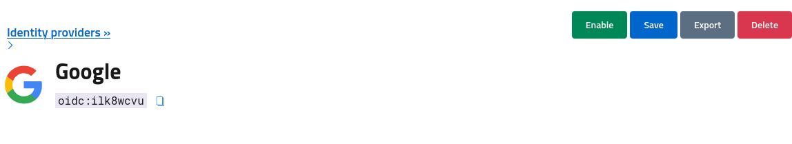

# Identity providers

Identity providers are the authorities dedicated to providing users with a valid *identity*, which is a structure which describes a given *subject* in terms of an *account* useful for authentication processes, and a set of *attributes*, key-value properties describing the user.

Example properties are *email address, name, surname* etc.

Identity providers are grouped and modeled under identity *authorities*, which are the components able to understand and leverage a given API or standard for retrieving user identities. Examples are *OpenID Connect, SAML, LDAP* etc.

In order to let users register and login into a given realm, it is mandatory to define and enable at least one *identity provider*, which will then be presented in login screens to unauthenticated users to start the sign in process.

## Create a new idp

By accessing the console, and navigating to the *authentication > identity provider* section, developers can register, manage and control providers registration for the selected realm.

Users can create a new provider by selecting an available authority from the *add provider* button, and filling the basic information in the modal dialog.

After the creation, the provider will be assigned a unique *identifier* and initialized with an empty or basic configuration. In order to effectively use the provider administrators will need to:

* complete the configuration
* enable the provider

Providers can be *enabled* or *disabled* globally, at need, and will be available for login only when enabled and *active*, which means the relative authority has validated the configuration and initialized the registration. On configuration errors providers will be inactivated, in order to avoid leaving users with a non-working option in login screens.

## Configure the idp

To configure the provider either click on the name or select the *edit* link from the *actions* menu.

The configuration section will be opened, with tabs dedicated to various aspect of the management. At minimum, each provider needs a valid *configuration*, according to the given authority. For example, *OpenId Connect* providers will need a valid upstream definition, while *SAML2* providers will need a proper metadata and asserting party configuration.

Following the example, which is a *google* provider, we can see in screens that the basic settings for *openid auto-configuration* are already configured.

Developers will need to register a valid application in the upstream identity provider, *Google* in this example, and obtain a set of credentials in the form *(clientId, clientSecret)*, which are needed for the *OAuth2 authorization code flow* performed at login.

The upstream *idp* will require a valid *callback/redirectURI*, which is the AAC address which will receive the authorization response. AAC defines a unique URL for each provider, which is displayed at the top of the configuration screen with a *copy* button.

After filling in all the configuration details, developers need to *save* the provider and the *enable* it via the toolbar buttons.

## Multiple providers

Many different providers can be configured and activated at the same time, with the option for each client application to individually enable or disable the idps available at the realm level.

The list highlights *active, available, disabled and misconfigured* providers with badges and colors for easy identification of the status.

