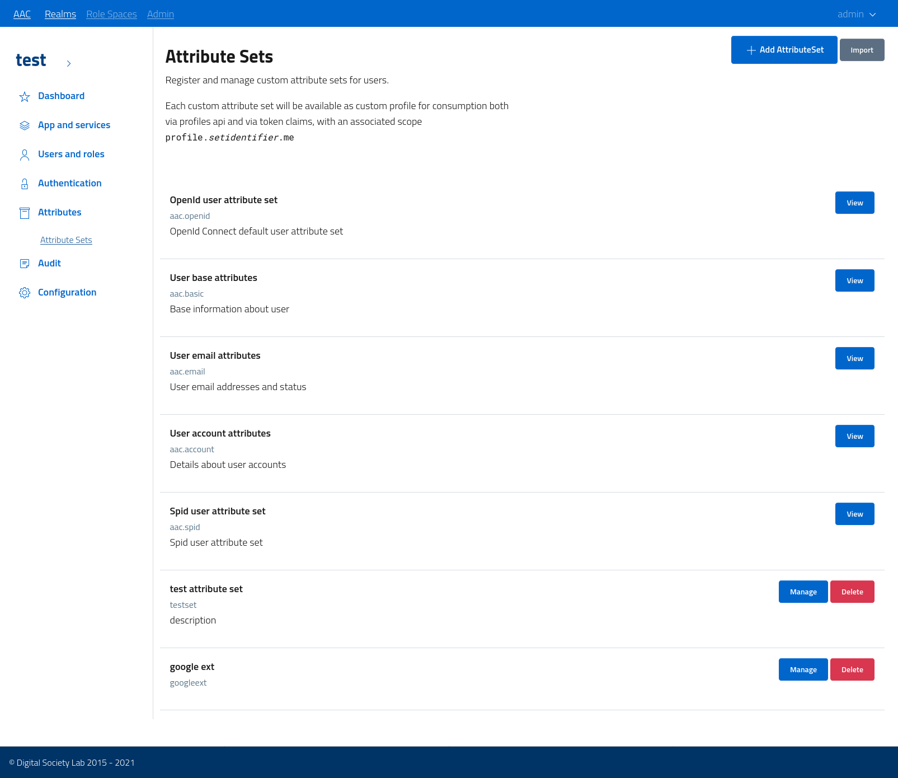
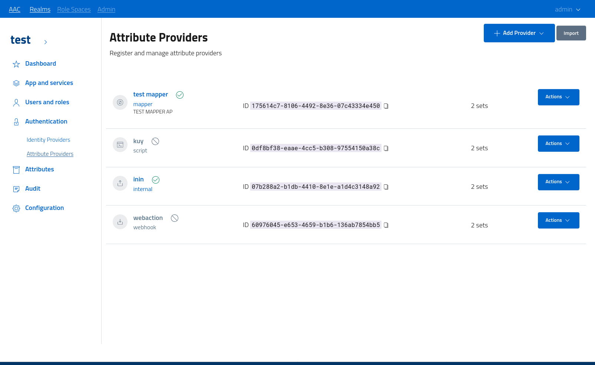
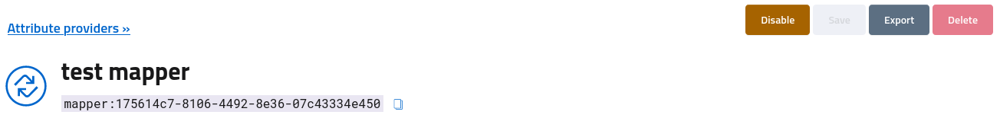

# User attributes

As previously introduced, user *identities* are composed by binding an *account* to one or more sets of *attributes*, which are properties describing an aspect of the user.
Attributes are stored in sets as *key-value* pairs, with the option of adhering to a schema.

By default, every user identity will possess at least a single attribute set, reporting all the properties exposed by the provider from the account itself. For example, the *internal* provider exports the *username* and *email*, along with details about the account registration, expiration etc. 
All these properties are mapped to an identity provider specific set, with both the content and the schema fully managed by the idp.

## Core attribute sets

In order to *consume* this attribute set in a standardized and uniform way, AAC defines a number of attribute sets with a specific schema and usage:

* **base attributes** are core information such as *name,surname,email,username*
* **email attributes** are core information on *email address* and *email verification*
* **account attributes** are core information about the account, such as *userid, provider, authority, realm*
* **openid attributes** are optional information described according to the *OpenID Connect* profile, such as *first and last name, email address, preferred username, language* etc.

These attribute sets are *derived* from the single idp attribute set by AAC, via mapping and translation. This process is automatic, and can be tuned and tailored to specific scenarios by editing idp attributes at login, via *custom mapping* (see the expert documentation).

## Additional attribute sets

In addition to core sets, which are defined by AAC and whose definitions are immutable, administrators can define *schemas* which describe properties as sets: by defining the *name, key, type* of attributes and registering the definition as *attribute set*, administrators will be able to define their custom properties in accordance to their scenario.

# Attribute sets

Attribute sets are managed from the realm console via a dedicated section, accessible by navigating to *attributes > attribute sets*

The section will report both the *core* and the *custom* attribute sets, with the first exposed as read-only for review and the second as read-write.

To create a new set click the *add* button and fill in the dialog with the following properties:

* **id** a globally unique identifier for the set
* **name** a descriptive label
  
  

By adding a new set the system will register the model and prepare an empty attribute set, ready for customization. Open the *manage* section by clicking on the action button.

## Attribute set management

The section is dedicated to the definition of an attribute set in terms of model and attributes.

The management console will let administrators define the list of attributes. Each attribute needs to register the *key*, a descriptive *name* and the field *type*. It is fundamental to select an appropriate field among those available to ensure proper attribute parsing, handling and translation.

## Attribute sets usage

When custom attribute sets are defined, user models will contain the instantiation of such models, according to the definition, as operated by *attribute providers*. To review and edit attributes open the user console at *users and roles > users*, select a subject and the navigate to the *attributes* section.

The interface will list every populated custom attribute set after the core models, and where supported by providers offer administrators the ability to either edit or create as new. All the custom attribute sets can also be deleted, but be aware that at the following login attribute providers can recreate and persist them again, according to the most up-to-date information and their generation rules.

# Attribute providers

AAC offers administrators the ability to integrate attributes gathered from the *identity providers* via the registration of *attribute providers*: additional services which receive in input a given user *principal* and return one or more additional *attribute sets*, according to a selected schema.

The idea is to offer an extension point during the authentication process, which can be used to integrate external information or manipulate the received properties in a custom way. 

Many different provider *authorities* are available out of the box, such as:

* **mappers**, which will receive a list of properties and *map* them to new attributes according to the schema
* **code**, which will *execute a function* to translate existing properties into new one
* **webhook**, which will call an external API to receive back one or more attribute sets.
* **internal**, which will provide an internal *key-value* store where users or administrators will manually register new properties

## Attribute providers console

To register and manage providers access the console by navigating to *authentication > attribute providers*. By default, the list will be empty: only core attribute sets are populated, by *identity providers*.

Add a new provider via toolbar action: select an *authority* and fill in a descriptive *name*.

Every attribute provider can be *active* or *inactive*: administrators can change the state by *enabling* and *disabling* providers at need.

Do note that every active attribute provider will be invoked in parallel during the authentication process: there is no relation between different providers and every one will receive in input the same user model, as gathered from the *identity provider*. Only after all the invocations are concluded AAC will merge the results, and associated all the custom *attribute sets* to the user.

Also note that attribute sets can be duplicated: every single instantiation will be defined by binding the set together with the source user and the processing provider. As such, a single provider can return a single instance of any associated attribute set, but different providers can also return an instance for the same set, with different values: it is up to consumers to choose which information they are interested in. As general rule, it is advisable to define a specific attribute set for every provider to avoid overlapping, and then perform any map or merge at consumption time via *profiles*.

## Attribute provider management

The management console exposes a configuration section common to all providers, with basic settings such as *name*,*description*, and then an advanced section specific for the given authority. 

In order to let the provider offer valid results, ready to be merged into the user model, administrators will need to *link* all the custom attribute sets which can be produced by the given provider. AAC will parse the result and then evaluate the correspondence to the various schemas: only valid and registered sets will be accepted.

To link a specific set flip the correspondent toggle switch under the *attribute sets* section of 
the console. 

Do note that *active* providers can not be updated: to persist any change it is mandatory to temporarily *disable* the provider, *save* the updates and then *enable* again. This flow is required to make sure that any operation currently happening is concluded before changing the registration.
The toolbar offers the various action buttons to support this flow.

## Attribute provider test

AAC supports the execution of a *test* flow for attribute providers, where the *currently logged-in* user is used as principal: the attribute provider will be called with the user properties simulating an authentication operation and the result will be mapped to attribute sets according to definition.

To perform the test open the attribute provider console, navigate to *test* and select the action.
The input model and the results will be shown in the interface, along with any error message generated by the provider.

Future versions will offer the ability to *mock* the user principal to simulate specific scenarios.