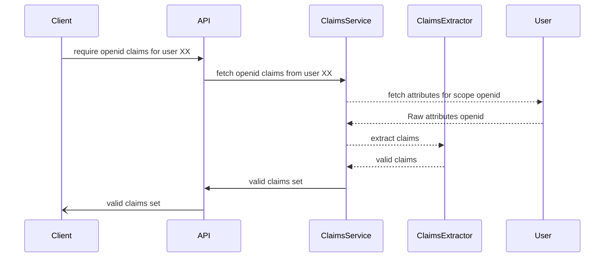
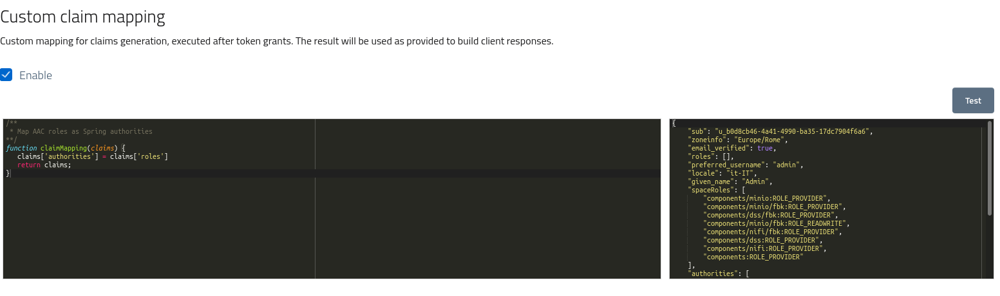
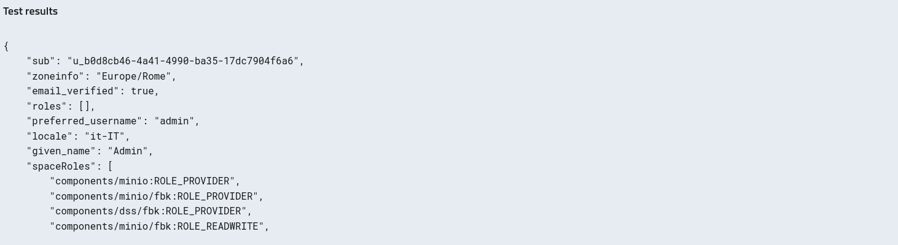

# Standard and custom claims

Both *access tokens* and *identity tokens* (from OAuth2 and OpenId Connect) are designed and implemented as a way to securely transmit verifiable information between an asserting party and a consuming party.
In this scenario AAC is always the *asserting* party, while clients and custom services are the *consuming* parties.

AAC collects and manages lots of information about users, their authentication status, the active sessions, the user attributes and identities etc. 
All this data is accessible to authorized consumers, via user approval, in the form of **claims**: an assertion format where each key in the token represents a specific piece of information about the *subject*.

Claims are the result of a process which digests user *identities* and extracts, transforms and the formats attributes in a format which adheres to the claim specification. The process is performed at each interaction, be it a token request, an API call, a user request etc. Internally, AAC may apply *caching* to optimize the performance and reduce the overhead.



Internally, each claims set is extracted from raw user attributes by a *claims extractor*, a customizable component which ingests an attribute map and performs mapping, function execution, translation etc according to the definition. The claims service may cache the results when the input attributes map doesn't change.

When adopting JWT as token format, assertions are expressed as json properties inside the payload. Otherwise, they will be readable as either JSON or YAML via api access, token introspection, userinfo endpoints etc, depending on the kind of information and the client capabilities.

The following sections will briefly describe the base assertion sets, and then the chapter will illustrate the topic of custom claims in detail.

## Standard claims

By default, every client will receive a set of *standard claims* inside every token, matching the requested (and approved) **scopes** and the token **audience**.

Of notable interest are user profiles, as expressed by *openid*, *profile* and *profile_xx_me* scopes.

All these claims sets are statically configured in AAC, and administrators can not change the results of the extraction process in any way, to ensure consistency and security across the whole system.

Do note that developers can still customize the final results returned to clients by deriving *custom claims* from the standards sets, as long as the claims are properly namespaced, formatted and addressed to ensure they do not overlap with core sets. The dedicated section will demonstrate how to perform this task.


### Base JWT claims


### OpenID profile claims


### Account claims


### Session claims

### Roles claims


## Custom claims

While standard attribute sets, profiles and claims cover a wide set of scenarios, developers may have the need to fully manage claims to cover their unique requirements, such as:

* custom namespaces
* custom formatting
* custom syntax
* custom naming

and many others.

AAC offers developers the ability to fully address these needs by implementing **custom claims mapping** at the client level. When configured, each token (access or identity) can be enriched with a set of *claims* produced by a custom **javascript function**, which is executed by AAC within the token generation flow.

As such, developers can have access to all the user and session *attributes*, as authorized by the requested and approved scopes, and then perform their custom logic to return in result a properly formatted set of *claims*. 

For example, a simple mapping function could rename a standard attribute under a different key such as the examples below.

```javascript
/**
 * Map OpenID preferred username field into username for Spring compatibility
**/
function claimMapping(claims) {
   claims['username'] = claims['preferred_username']
   return claims;
}


```
and 

```javascript
/**
 * Map AAC roles as Spring authorities
**/
function claimMapping(claims) {
   claims['authorities'] = claims['roles']
   return claims;
}
```

Internally, AAC will define a custom *function code extractor* which will receive the user attributes, execute the code and then return the claims map in a proper validated format. On successful exections, tokens will contain all the *claims* reported in the map, along with non-optional core claims such as *subject identifier* ,*audience*, *expiration time* etc.

### Claims configuration

In order to configure the custom claim extraction developers need to open the console, navigate to *app and services > client applications* and then open a given client in *edit* mode.

Under the *Hooks & claims* tab the console will offer the *custom claim mapping* configuration section, with a code editor and a simple debugger for testing.



The code editor has syntax highlighting and formatting. To persist changes remember to *save* the updates via the toolbar action.


### Claims function

The claim mapping is performed via a *javascript* function which is executed in an isolated and secured context, with no access to the environment or to external libraries. The code is executed *synchronously* and the results may be cached during token flows, but are always executed from scratch during testing.

The input received from the function is a *claims* map, where every key corresponds to a core claim, as specified by the requested scopes and processed by internal extractors. 

Base attributes are mapped to primitive types, such as *string*, *number* and *boolean* values, while complex claims are translated into javascript *objects*.

```
/**
 * Custom claim mapping
**/
function claimMapping(claims) {
    /*
    * claims is a map
    * access properties via keys:
    * claims['username'] or claims.username
    */ 
    claims['full_name'] = claims['first_name']+ " "+claims["last_name]

    /*
    * return the same map with modifications
    */
    return claims;
}
```

Do note that the return value should be the same map enriched with modifications such as:

* adding new claims
* removing existing claims
  
The system will check that all the core claims are either returned untouched, or completely removed. Claims already contained in the map are *unmodifiable* by developers.

When claims already inserted in the map by the core extractors are removed by the custom mapping code, they will effectively be dropped from *tokens*, when acceptable by the specification. This functionality can cover custom scenarios where core claims are not needed, or too much verbose and detailed, but the information they carry is fundamental to consumers.

For example, a custom role mapping could analyze the user realm roles, keep only those relevant for the client by putting these in a custom claim, and then drop the core claim to ensure tokens won't leak unnecessary information. This approach can effectively increase the confidentiality and security of the system, by applying a claims policy more granular than the one available via *scopes*.

```
/**
 * Custom claim mapping with removal
**/
function claimMapping(claims) {
    /*
    * token is requested with 'user.roles.me' scope
    * claims['roles'] will contain all the user roles
    */ 
    var roles = claims['roles];

    /*
    * we want to keep only roles for this service
    */
    let prefix = 'TEST_';    
    claims['test_roles'] = roles.filter(r => r.startsWith(prefix))

    /*
    * we also drop the full roles claim
    */
    claims['roles'] = null;

    /*
    * return the map with 'test_roles' and no 'roles'
    */
    return claims;
}
```

The example demonstrates how developers can keep only a subset of user roles, by manipulating the claims map to exclude the full list and insert a custom claim with only the relevant roles. Do note that the final result may still contain the dropped claim, as an empty key with no content, when the claim presence is dictated by the token flow, standards compliance or formatting needs.

This approach can be leveraged to support many different scenarios, by requesting access to all the user attributes as needed, and then filtering claims to ensure proper mapping and to reduce information exposure.


### Claims testing

The management console lets developers test the execution of their custom function, by receiving in input their own authentication, as stored in their session, and applying the mapping.

The result will report any error with the detailed reason, and also highlight the output of the function as a formatted json view.




Do note that *testing* the function won't impact the currently active client configuration: only after save modification will be taken into account for token flows.
