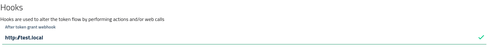
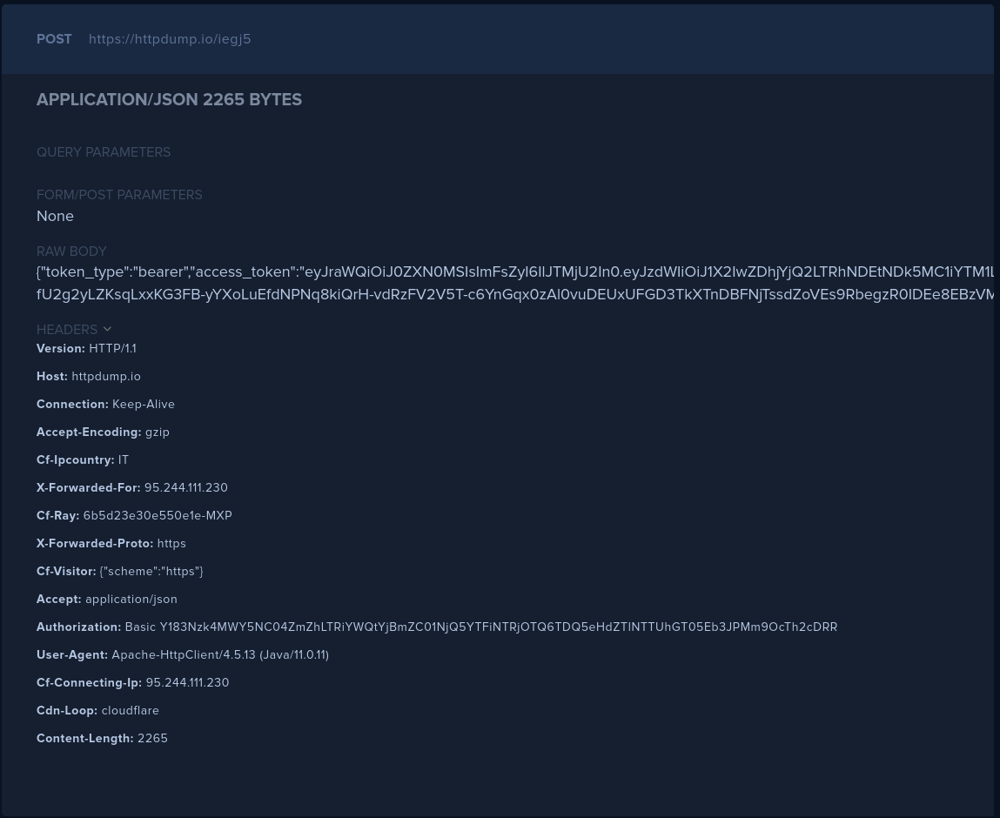

# Hooks

Hooks are an extension point inside the modular architecture of AAC. Developers and administrators can alter or enrich the functionality of AAC by adding hooks which perform a specific action, altering the default flow to cover their custom scenario.

For example, hooks can be used to signal to external components the execution of an action (an event), such as a successful token generation. The external listener will be able to perform actions on their own, as a response to the event: for example, they could synchronize their user repository, or prepare the context for the token reception.

Furthermore, some hooks lets developers alter the behavior, by returning as response a slightly different version of the action itself. For example, clients could alter their own token requests to include some kind of custom parameter, or to perform some kind of check. 

A common scenario leveraging this approach is the verification of users against a preauthorized list: before processing the token request, AAC will invoke the hook where the custom code can access both request parameters and user context, compare the username against a list and the either accept or deny the request.

While AAC already implements and exposes a number of extension points, the list of supported hooks will in time grown to cover all the relevant points in the AAC architecture.

## Client hooks

The extension points allows developers to customize the OAuth2 token grant flow by intercepting in-flight requests to either:

* **modify parameters** for user approval and token generation
* **register events** and communicate with external parties

Hooks can execute a *custom action*, which is defined via a model which receives in input the event and the context parameters, and expects in return a valid response with the modified parameters.

Actions can be performed via two main technologies:

* *javascript* functions executed in a separated environment
* *webhooks* which invoke an external URL

To discover and learn the details please look at the detailed documentation.

The following hooks are available for clients:

* `before_approval` hook
* `after_approval` hook
* `before_token` hook

The *before user approval* hook can modify request parameters, such as requested scopes, security context classes, audiences, requested claims etc. The action will receive in input the parsed request and then return a modified copy, with compatible configuration. For example, it is not possible to change the requesting party (i.e. the client), the authorization grant requested, the state parameters etc..

The *after user approval* hook can perform an action depending on the approval status received from users. For example, it can terminate a request where the user didn't approve all the scopes, or it can register the event.

The *before token grant* hook can perform *partial* request modification, for example by filtering the approved scopes to a subset, and it can perform access decisions to either continue or stop the flow. For example, it could perform a lookup for the user to determine whether the user is authorized to access the audience, or evaluate some kind of policy. This hook can also be used to call external systems to perform synchronization of user profiles and attributes, for example to pre-populate a user repository in the backend service before the client hits the resource endpoint with an access or id token.

### Client hooks configuration

To define hooks access the management console and select the *hooks & claims* section. As of now, the only extension point available from the developer console is the *before token grant* hook, which can be invoked with a custom URL for a webhook POST action.

Set a valid URL as destination and then try the connection by requesting a *test* token via the console. The endpoint will receive a POST with the token content as body, and an authentication header set as follows:

* Basic authentication
* clientId with clientSecret
  
Invocations are not cached: every token generation will hit the remote endpoint. Please make sure the remote services can handle the expected load.

Note: By calling an external endpoint developers are transferring sensitive and confidential information with an outside party: make sure you trust the receiving end with private data.

An example invocation is depicted in figure.

## Identity provider hooks

Identity providers handle the user authentication process. AAC offers an extension point for hooks which developers can leverage to provide custom actions doing post-processing of authenticated *principals*.

User performing authentication leverage a user *account* registered with a specific *identity provider* to complete the login process, and obtain a valid user *identity* which contains:

* the authentication token
* the user account
* one or more sets of user attributes

The authentication process is defined by the identity provider implementation, and can not be altered in any way. The extension point is defined *after* the authentication step, before turning the various properties listed above in a complete user *identity* bound to the current *session*.

As such, hooks on identity providers can perform two operations:

* `attribute mapping`, altering the user attributes received from the authentication
* `access control`, performing pass/block decisions based on the given principal and the request context

The *attribute mapping* hook lets developers perform attribute translation on the single set received from the identity provider, to manually tune the properties. For example, the mapping can align attribute names to the common schema, by adding a `username` attribute derived from the `preferred_username` field. Another common use case is adapting the format, for example by parsing and rewriting dates.

The *access control* hook lets administrators add a custom access decision point during the login via the selected provider. For example, a common use case is to let users login only during work hours, or make sure only members of a given list can login via social providers, etc.

Same as with client hooks, idp actions can be performed via two main technologies:

* *javascript* functions executed in a separated environment
* *webhooks* which invoke an external URL

### IdP hooks configuration

To configure identity provider hooks, access the management console, select the *authentication* section and open an identity provider in *edit* mode.

As of now, the only hook configurable via developer console is the *attribute mapping*, which is available for integration via a custom *javascript function*.

By implementing a function which takes in input the raw attributes map and returns the modified map, developers can alter the attribute set received from the idp and used as basis for the identity construction. 

Do note that all the *attribute providers* defined in the realm will be invoked with the updated principal, as defined by the custom attribute mapping of the selected idp. The original (i.e. unaltered) attributes received at authentication time won't be persisted in the session. As such, by removing critical properties such as *email,username* from the map the resulting user principals won't be usable for token generation.