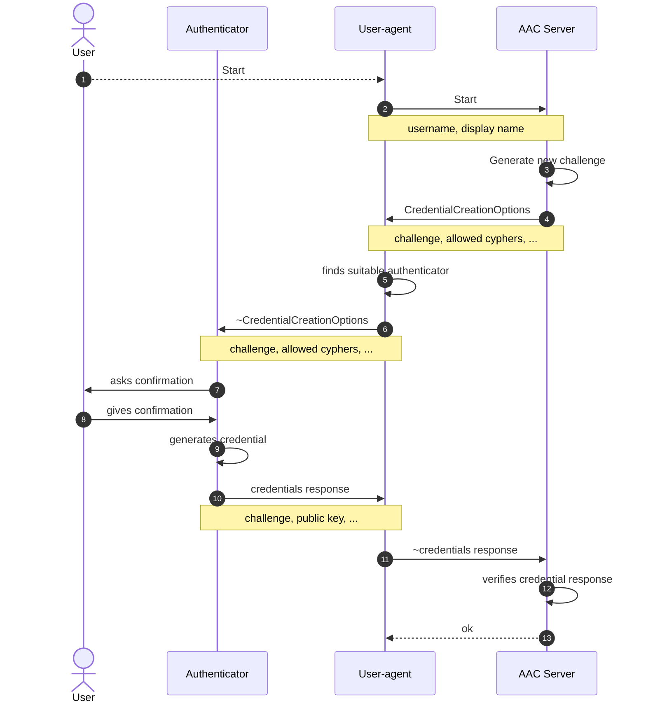
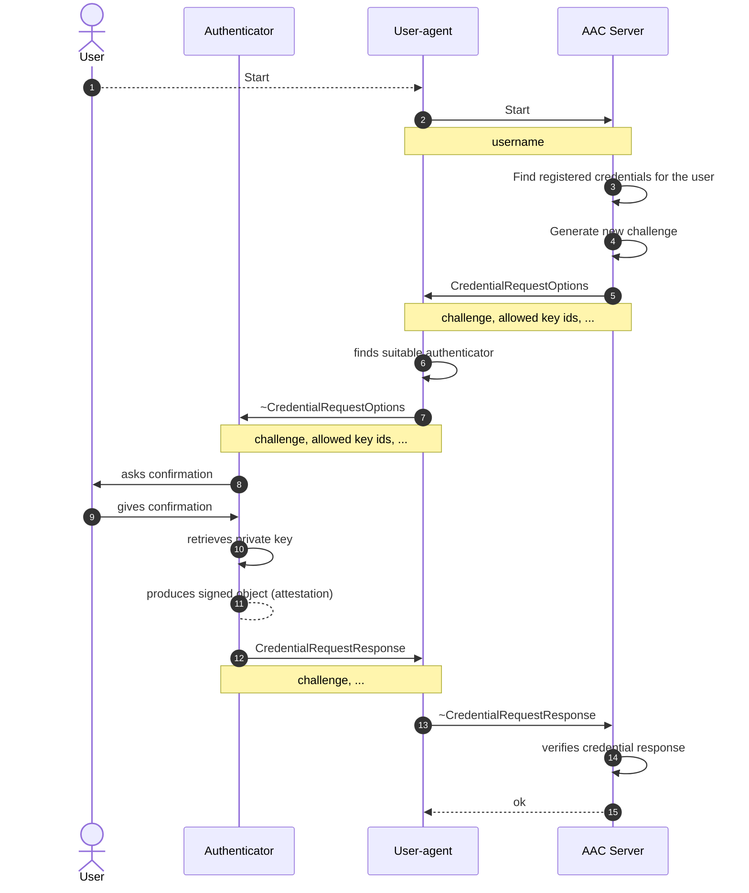

# WebAuthn

AAC realm administrators can choose to let their users authenticate through [WebAuthn](https://www.w3.org/TR/webauthn/) using the dedicated provider.

## WebAuthn fundamentals

This section contains a recap of the WebAuthn [specification](https://www.w3.org/TR/webauthn/). It is a simplified version; please refer to the official specification for further details.

WebAuthn allows users to authenticate using a private key stored in a secure piece of hardware -or software- known as `authenticator`.
Based on some parameters chosen by the server, the authenticator can generate a key pair, and the public key is sent to the server during registration.
Before being used, the authenticator must be unlocked. On some models it is sufficient to tap a button, on others a some biometrics or a PIN may be required.

When the user needs to authenticate, the server uses the public key to verify a message the user sends using the private key.

One of the peculiarities of WebAuthn is that no secret information ever reaches the server -as it would be the case if we were to use, for example, password-based authentication-.

Given that the credential (i.e., the public and private keys, plus other data) is generated and sotred in hardware, the cognitive effort of the user can be greatly reduced. Moreover, the server is able to enforce the use of cryptographic algorithms it considers strong.

### WebAuthn authentication flows

WebAuthn defines two authentication flows known as _ceremonies_:

#### Registration ceremony

This ceremony is used to let the user register a new credential.

1. The ceremony starts with a request from the user agent, in which the user provides their username (points 1 and 2 of the sequence diagram).
1. AAC generates a random sequence of bytes known as _challenge_ (point 3 of the sequence diagram). The challenge is used to guarantee freshness in subsequent parts of the ceremony, much like a nonce in other protocols.
1. The AAC server replies to the request with an object containing information about the characteristichs that the key about to be generated must have in order to be valid -e.g., allowed cryptographic algorithms- (point 4 of the sequence diagram).
1. User confirms to the authenticator that they want to proceed (point 8 of the sequence diagram).
1. At this point, the authenticator uses generates a new public and private key pair, and sends the public key back to the server inside an object signed with the private key (points 9-11 of the sequence diagram).
1. The server associates the public key with the user's account and completes the registration (points 12 and 13 of the sequence diagram).

AAC allows an already-authenticated user to register additional credentials for account recovery purposes.

#### Authentication ceremony

This ceremony allows the user to authenticate using one of their previously registered credentials.

1. The user agent asks to start the authentication, providing the username (points 2 of the sequence diagram).
1. AAC uses the username to resolve the registered credentials (point 2 of the sequence diagram).
1. AAC generates a new challenge (see point 3 of the registration ceremony).
1. The AAC server replies with an object containing the identifiers of the public keys associated with that user and the challenge (point 5 of the sequence diagram).
1. The user agent finds a suitable authenticator (point 6 of the sequence diagram).
1. The user confirms to the authenticator that they want to proceed in authenticating (point 9 of the sequence diagram).
1. The authenticator retrieves the private key and uses it to produce a signed response, which contains the challenge (points 10-12 of the sequence diagram).
1. The server uses the public key to verify if the signature is valid (point 14 of the sequence diagram). If it is, the user has successfully authenticated.

### Some pros and cons

#### Pros

- Low cognitive effort for the users.
- No secret data is on the server.
- Server can enforce the use of strong cryptographic primitives.
- Built-in protection in the case of cloned credentials.
- The server can choose to only allow authenticators with given features (e.g., it can decide to deny registrations from the ones that can be unlocked without requiring any PIN/fingerprint).

#### Cons

- If the users lose all their authenticators, they can not login anymore.
- Users may need to phisically carry the authenticator with them.

## Configuration

To allow users to use the WebAuthn provider, enter the realm dashboard and go to authentication -> identity providers.

At this point, click on the button "Add Provider" and select "WebAuthn". A dialog will pop upasking for the necessary configuration.
Among those, the relying party name is intended only to be displayed to the user.

After having hit 'save', proceed to activate the provider to make it available to your users.
